Note: This was translated from PDF by [@pooyak](https://github.com/pooyak/hyperloop)

# Hyperloop Alpha

**Intro**

The  first  several  pages  will  attempt  to  describe  the  design  in  everyday
language, keeping numbers to a minimum and avoiding formulas and jargon. I
apologize in advance for my loose use of
language and imperfect analogies.

The  second  section  is  for  those  with  a  technical  background.  There  are  no
doubt  errors  of  various  kinds  and  superior  optimizations  for  elements  of  the
system.  Feedback  would  be  most  welcome  –  please  send  to
[hyperloop@spacex.com  ](mailto:hyperloop@spacex.com)o[r  hyperloop@teslamotors.com.  ](mailto:hyperloop@teslamotors.com)
I  would  like  to  thank
my  excellent  compadres  at  both  companies  for  their  help  in  putting  this
together.

**Background**

When the California “high speed” rail was approved, I was quite disappointed,
as  I  know  many  others  were  too.  How  could  it  be  that  the  home  of  Silicon
Valley and JPL – doing incredible things like indexing all the world’s knowledge
and putting rovers on Mars – would build a bullet train that is both one of the
most  expensive  per  mile  and  one  of  the  slowest  in  the  world?  Note,  I  am
hedging  my  statement  slightly  by  saying  “one  of”.  The  head  of  the  California
high speed rail project called me to complain that it wasn’t the very slowest
bullet train nor the very most expensive per mile.

The  underlying  motive  for  a  statewide  mass  transit  system  is  a  good  one.  It
would be great to have an alternative to flying or driving, but obviously only if
it is actually *better* than flying or driving. The train in question would be both
slower, more expensive to operate (if unsubsidized) and less safe by two orders
of magnitude than flying, so why would anyone use it?

If we are to make a massive investment in a new transportation system, then
the return should by rights be equally massive. Compared to the alternatives,
it
should ideally be:

* Safer
* Faster
* Lower cost
* More convenient
* Immune to weather
* Sustainably self-powering
* Resistant to Earthquakes
* Not disruptive to those along the route

Is there truly a new mode of transport – a fifth mode after planes, trains, cars
and boats – that meets those criteria and is practical to implement?
Many ideas
for a system with most of those properties have been proposed and should be
acknowledged, reaching as far back as Robert Goddard’s to proposals in recent
decades by the Rand Corporation and ET3.

Unfortunately, none of these have panned out. As things stand today, there is
not  even  a  short  distance  demonstration  system  operating  in  test  pilot  mode
anywhere  in  the  world,  let  alone  something  that  is  robust  enough  for  public
transit. They all possess, it would seem, one or more fatal flaws that prevent
them from coming to fruition.

**Constraining the Problem**

The  Hyperloop  (or  something  similar)  is,  in  my  opinion,  the  right  solution  for
the specific case of high traffic city pairs that are less than about 1500 km or
900  miles  apart.  Around  that  inflection  point,  I  suspect  that  supersonic  air
travel ends up being faster and cheaper. With a high enough altitude and the
right geometry, the sonic boom noise on the ground would be no louder than
current  airliners,  so  that  isn’t  a  showstopper.  Also,  a  quiet  supersonic  plane
immediately  solves  *every*  long  distance  city  pair  without  the  need  for  a  vast
new worldwide infrastructure.

However, for a sub several hundred mile journey, having a supersonic plane is
rather pointless, as you would spend almost all your time slowly ascending and
descending and very little time at cruise speed. In order to go fast, you need to
be at high altitude where the air
density drops exponentially, as air at sea level
becomes  as  thick  as  molasses  (not  literally,  but  you  get  the  picture)  as  you
approach sonic velocity.

**So What is Hyperloop Anyway?**

Short  of  figuring  out  real  teleportation,  which  would  of  course  be  awesome
(someone please do this), the only option for super fast travel is to build a tube
over  or  under  the  ground  that  contains  a  special  environment.  This  is  where
things get tricky.

At one extreme of the potential solutions is some enlarged version of the old
pneumatic tubes used to send mail and packages within and between buildings.
You  could,  in  principle,  use  very  powerful  fans  to  push  air  at  high  speed
through  a  tube  and  propel  people-sized  pods  all  the  way  from  LA  to  San
Francisco.  However,  the  friction  of  a  350  mile  long  column  of  air  moving  at
anywhere near sonic velocity against the inside of the tube is so stupendously
high that this is impossible for all practical purposes.

Another  extreme  is  the  approach,  advocated  by  Rand  and  ET3,  of  drawing  a
hard  or  near  hard  vacuum  in  the  tube  and  then  using  an  electromagnetic
suspension.  The  problem  with  this  approach  is  that  it  is  incredibly  hard  to
maintain  a  near  vacuum  in  a  room,  let  alone  700  miles  (round  trip)  of  large
tube  with  dozens  of  station  gateways  and  thousands  of  pods  entering  and
exiting every day. All it takes is one leaky seal or a small crack somewhere in
the hundreds of miles of tube and the whole system stops working.

However, a low pressure (vs. almost no pressure) system set to a level where
standard  commercial  pumps  could  easily  overcome  an  air  leak  and  the
transport  pods  could  handle  variable  air  density  would  be  inherently  robust.
Unfortunately, this means that there is a non-trivial amount of air in the tube
and leads us straight into another problem.

**Overcoming the Kantrowitz Limit**

Whenever  you  have  a  capsule  or  pod  (I  am  using  the  words  interchangeably)
moving at high speed through a tube containing air, there is a minimum tube to
pod area ratio below which you will choke the flow. What this means is that if
the walls of the tube and the capsule are too close together, the capsule will
behave like a syringe and eventually be forced to push the entire column of air
in the system. Not good.

Nature’s  top  speed  law  for  a  given  tube  to  pod  area  ratio  is  known  as  the
Kantrowitz limit. This is highly problematic, as it forces you to either go slowly
or  have  a  super  huge  diameter  tube.  Interestingly,  there  are  usually  two
solutions to the Kantrowitz limit – one where you go slowly and one where you
go really, really fast.
 The latter solution sounds mighty appealing
at first, until you realize that going
several thousand miles per hour means that you can’t tolerate even wide turns
without painful g loads. For a journey from San Francisco to LA, you will also
experience a rather intense speed up and slow down. And, when you get right
down  to  it,  going  through  transonic  buffet  in  a  tube  is  just  fundamentally  a
dodgy prospect.

Both  for  trip  comfort  and  safety,  it  would  be  best  to  travel  at  high  subsonic
speeds for a 350 mile journey. For much longer journeys, such as LA to NY, it
would  be  worth  exploring  super  high  speeds  and  this  is  probably  technically
feasible,  but,  as  mentioned  above,  I  believe  the  economics  would  probably
favor a supersonic plane.

The approach that I believe would overcome the Kantrowitz limit is to mount
an electric compressor fan on the nose of the pod that actively transfers high
pressure air from the front to the rear of the vessel. This is like having a pump
in the head of the syringe actively relieving pressure.

It would also simultaneously solve another problem, which is how to create a
low friction suspension system  when traveling at over 700 mph.  Wheels don’t
work  very  well  at  that  sort  of  speed,  but  a  cushion  of  air  does. Air  bearings,
which  use  the  same  basic  principle  as  an  air  hockey  table,  have  been
demonstrated  to  work  at  speeds  of  Mach  1.1  with  very  low  friction.  In  this
case, however, it is the pod that is producing the air cushion, rather than the
tube,
as it is important to make the tube as low cost and simple as possible.

That then begs the next question of whether a battery can store enough energy
to power a fan for the length of the journey with room to spare. Based on our
calculations, this is no problem, so long as the energy used to accelerate the
pod is not drawn from the battery pack.

This  is  where  the  external  linear  electric  motor  comes  in,  which  is  simply  a
round  induction  motor  (like  the  one  in  the  Tesla  Model  S)  rolled  flat.  This
would  accelerate  the  pod  to  high  subsonic  velocity  and  provide  a  periodic
reboost roughly every 70 miles. The linear electric motor is needed for as little
as \~1% of the tube length, so is not particularly costly.

**Making the Economics Work**

The pods and linear motors are relatively minor expenses compared to the tube
itself – several hundred million dollars at most, compared with several billion
dollars for the tube. Even several billion is a low number when compared with
several tens of billion proposed for the track of
the California rail project.

The key advantages of a tube vs. a railway track are that it can be built above
the  ground  on  pylons  and  it  can  be  built  in  prefabricated  sections  that  are
dropped  in  place  and  joined  with  an  orbital  seam  welder.  By  building  it  on
pylons,  you  can  almost  entirely  avoid  the  need  to  buy  land  by  following
alongside  the  mostly  very  straight  California  Interstate  5  highway,  with  only
minor deviations when the highway makes a sharp turn.
 Even when the Hyperloop path deviates from the highway,
it will cause minimal
disruption to farmland roughly comparable to a tree or telephone pole, which
farmers  deal  with  all  the  time.  A  ground  based  high  speed  rail  system  by
comparison  needs  up  to  a  100  ft  wide  swath  of  dedicated  land  to  build  up
foundations for both directions, forcing people to travel for several miles just
to  get  to  the  other  side  of  their  property.  It  is  also  noisy,  with  nothing  to
contain the sound, and needs unsightly protective fencing to prevent animals,
people or vehicles from getting on to the track. Risk of derailment is also not
to be taken lightly, as demonstrated by
several recent fatal train accidents.

**Earthquakes and Expansion Joints**

A ground based high speed rail system is susceptible to Earthquakes and needs
frequent  expansion  joints  to  deal  with  thermal  expansion/contraction  and
subtle, large scale land movement.

By building a system on pylons, where the tube is not rigidly fixed at any point,
you can dramatically mitigate Earthquake risk and avoid the need for expansion
joints. Tucked away inside each pylon, you could place two adjustable lateral
(XY) dampers and one vertical (Z) damper.

These  would  absorb  the  small  length  changes  between  pylons  due  to  thermal
changes, as well as long form subtle height changes.  As land slowly settles to a
new  position  over  time,  the  damper  neutral  position  can  be  adjusted
accordingly.  A  telescoping  tube,  similar  to  the  boxy  ones  used  to  access
airplanes  at  airports  would  be  needed  at  the  end  stations  to  address  the
cumulative length change of the tube.

**Can it Really be Self-Powering?**

For the full explanation, please see the technical section, but the short answer
is that by placing solar panels on top of the tube, the Hyperloop can generate
far in excess of the energy needed to operate. This takes into account storing
enough energy in battery packs to operate at night and for periods of extended
cloudy weather. The energy could also be stored in the form of compressed air
that then runs an electric fan in reverse to generate energy, as demonstrated
by LightSail.

****

**Hyperloop Preliminary Design Study**

**Technical Section**

****

[abstract] **1. Abstract**

Existing conventional modes of transportation of people consists of four unique
types:  rail,  road,  water,  and  air.  These  modes  of  transport  tend  to  be  either
relatively slow (i.e., road and water), expensive (i.e., air), or a combination of
relatively slow and expensive (i.e., rail). Hyperloop is a new mode of transport
that  seeks  to  change  this  paradigm  by  being  both  fast  and  inexpensive  for
people and goods. Hyperloop is also unique in that it is an open design concept,
similar  to  Linux.  Feedback  is  desired  from  the  community  that  can  help
advance the Hyperloop design and bring it from concept to reality.

Hyperloop consists of a low pressure tube with capsules that are transported at
both low and high speeds throughout the length of the tube. The capsules are
supported on a  cushion  of air,  featuring pressurized  air and  aerodynamic  lift.
The  capsules  are  accelerated  via  a  magnetic  linear  accelerator  affixed  at
various stations on the low pressure tube with rotors contained in each capsule.
Passengers may enter and exit Hyperloop at stations located either at the ends
of the tube, or branches along the tube length.

In  this  study,  the  initial  route,  preliminary  design,  and  logistics  of  the
Hyperloop  transportation  system  have  been  derived.  The  system  consists  of
capsules  that  travel  between  Los  Angeles,  California  and  San  Francisco,
California.  The  total  trip  time  is  approximately  half  an  hour,  with  capsules
departing  as  often  as  every  30  seconds  from  each  terminal  and  carrying  28
people  each.  This  gives  a  total  of  7.4  million  people  each  way  that  can  be
transported  each  year  on  Hyperloop.  The  total  cost  of  Hyperloop  in  this
analysis is under \$6 billion USD. Amortizing this capital cost over 20 years and
adding daily operational costs gives a total of  about \$20 USD (in current year
dollars) plus operating costs per
one-way ticket on the passenger Hyperloop.

Useful  feedback  is  welcomed  on  aspects  of  the  Hyperloop  design.  E-mail
feedback to[ hyperloop@spacex.com ](mailto:hyperloop@spacex.com)o[r hyperloop@teslamotors.com.](mailto:hyperloop@teslamotors.com)

[toc] **2. Table of Contents**

1. [Abstract][abstract]
2. [Table of Contents][toc]
3. [Background][background]
4. [Hyperloop Transportation System][transport]
4.1. [Capsule][capsule]
4.1.1. [Geometry][capsule_geom]
4.1.2. [Interior][capsule_interior]
4.1.3. [Compressor][capsule_compressor]
4.1.4. [Suspension][capsule_suspension]
4.1.5. [Onboard Power][capsule_power]
4.1.6. [Propulsion][capsule_propulsion]
4.1.7. [Cost][capsule_cost]
4.2. [Tube][tube] 
4.2.1. [Geometry][tube_geom]
4.2.2. [Tube Construction][tube_construction]
4.2.3. [Pylons and Tunnels][tube_pylons]
4.2.4. [Station Construction][tube_station]
4.2.5. [Cost][tube_cost]
4.3. [Propulsion][prop]
4.3.1. [Capsule Components (Rotor)][prop_rotor]
4.3.2. [Tube Components (Stator)][prop_stator]
4.3.3. [Energy Storage Components][prop_energy]
4.3.4. [Cost][prop_cost]
4.3.5. [Propulsion for Passenger Plus Vehicle System][prop_passenger]
4.4. [Route][route]
4.4.1. [Route Optimization][route_opt]
4.4.1.1. [Los Angeles/Grapevine - South][route_la_s]
4.4.1.2. [Los Angeles/Grapevine – North][route_la_n]
4.4.1.2. [I-5][route_i5]
4.4.1.3. [I-580/San Francisco Bay][route_i580]
4.4.3. [Station Locations][route_stations]
4.5. [Safety and Reliability][safety]
4.5.1. [Onboard Passenger Emergency][safety_passenger]
4.5.2. [Power Outage][safety_power]
4.5.2. [Capsule Depressurization][safety_capsule]
4.5.3. [Capsule Stranded in Tube][safety_stranded]
4.5.4. [Structural Integrity of the Tube in Jeopardy][safety_tube]
4.5.5. [Earthquakes][safety_earth]
4.5.6. [Human Related Incidents][safety_human]
4.5.7. [Reliability][safety_reliability]
4.6. [Cost][cost]
6. [Conclusions][conclusions]
7. [Future Work][future]

[background]**3. Background**

The  corridor  between  San  Francisco,  California  and  Los  Angeles,  California  is
one  of  the  most  often  traveled  corridors  in  the  American  West.  The  current
practical  modes  of  transport  for  passengers  between  these  two  major
population centers include:
 1.  Road (inexpensive, slow, usually not environmentally sound)
2.  Air (expensive, fast, not environmentally sound)
3.  Rail (expensive, slow, often environmentally sound)

A  new  mode  of  transport  is  needed  that  has  benefits  of  the  current  modes
without  the  negative  aspects  of  each.  This  new  high  speed  transportation
system has the following requirements:
 1.  Ready when the passenger is ready to travel (road)
2.  Inexpensive (road)
3.  Fast (air)
4.  Environmentally friendly (rail/road via electric cars)

The current contender for a new transportation system between southern and
northern  California  is  the  “California  High  Speed  Rail.”  The  parameters
outlining this system include:
 1.  Currently \$68.4 billion USD proposed cost
2.  Average  speed  of  164  mph  (264  kph)  between  San  Francisco  and  Los
 Angeles

3.  Travel  time  of  2  hours  and  38  minutes  between  San  Francisco  and  Los
 Angeles
 a.  Compare with 1 hour and 15 minutes by air
b.  Compare with 5 hours and 30 minutes by car****
 4.  Average one-way ticket price of
\$105 one-way [(reference)](http://sf.curbed.com/archives/2009/12/15/projected_ticket_price_goes_up_for_highspeed_rail_ridership_down.php)
 a.  Compare with \$158 round trip by air for September 2013
b.  Compare  with  \$115  round  trip  by  road  (\$4/gallon  with  30  mpg
 vehicle)

A  new  high  speed  mode  of  transport  is  desired  between  Los  Angeles  and  San
Francisco;  however,  the  proposed  California  High  Speed  Rail  does  not  reduce
current trip times or reduce costs relative to existing modes of transport. This
preliminary  design  study  proposes  a  new  mode  of  high  speed  transport  that
reduces  both  the  travel  time  and  travel  cost  between  Los  Angeles  and  San
Francisco.  Options  are  also  included  to  increase  the  transportation  system  to
other  major  population  centers  across  California.  It  is  also  worth  noting  the
energy cost of this system is less than any currently existing mode of transport

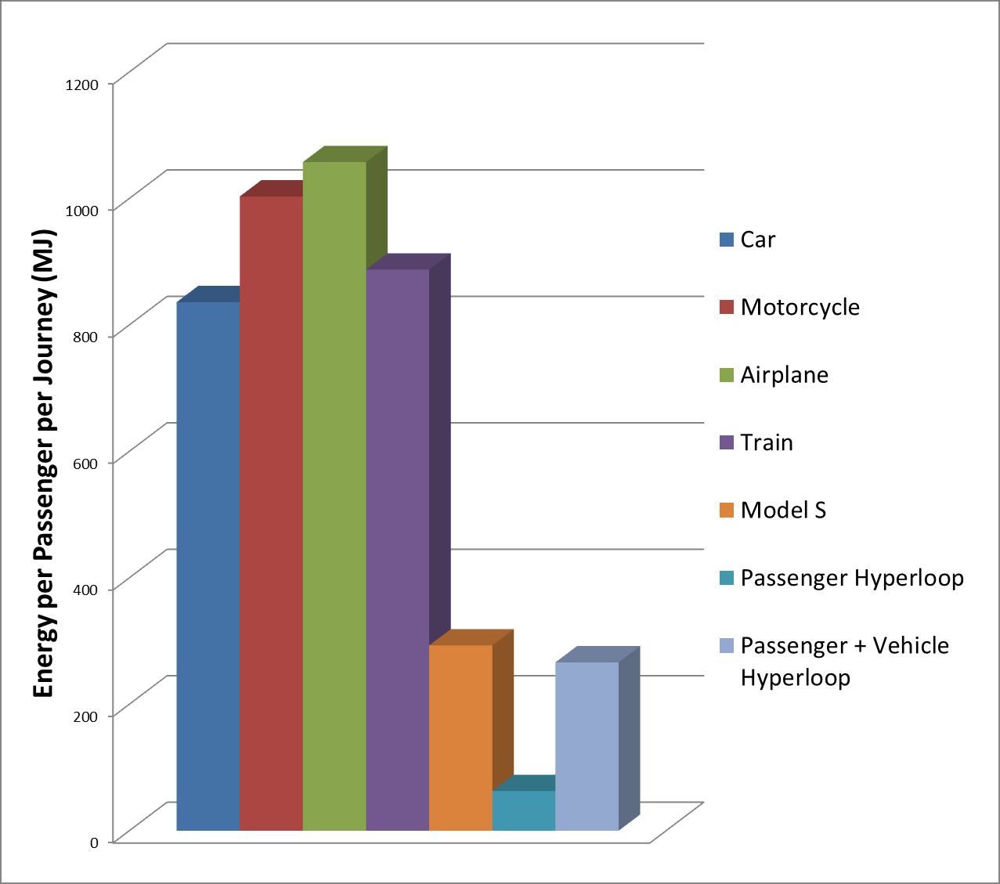

[(Figure  1).](hyperloop_alpha.html#9)  The  only  system  that  comes  close  to  matching  the  low  energy
requirements of Hyperloop is the fully electric Tesla Model S.

**Figure 1. Energy cost per passenger for a
journey between Los Angeles and San Francisco for**

**various modes of transport.**

[transport]**4. Hyperloop Transportation System**

Hyperloop [(Figure 2 ](hyperloop_alpha.html#10)throu[gh Figure 3) ](hyperloop_alpha.html#11)is a proposed transportation system for
traveling  between  Los  Angeles,  California, and  San  Francisco,  California  in  35
minutes. The Hyperloop consists of several distinct components,
including:
 1.  Capsule:

a.  Sealed capsules carrying 28 passengers each that travel along the
 interior of the tube depart  on average every 2 minutes from Los
Angeles  or  San  Francisco  (up  to  every  30  seconds  during  peak
usage hours).

b.  A larger system has also been sized that allows transport of 3 full
 size automobiles with passengers to travel in the capsule.

c.  The  capsules  are  separated  within the  tube  by  approximately  23
 miles (37 km) on average during operation.

d.  The  capsules  are  supported  via  air  bearings  that  operate  using a
 compressed air reservoir and aerodynamic lift.
 2.  Tube:

a.  The tube is made of steel. Two tubes will be welded together in a

side  by  side  configuration  to  allow  the  capsules  to  travel  both
directions.
 b.  Pylons are placed every 100 ft (30 m) to support the tube.
c.  Solar  arrays  will  cover  the  top  of  the  tubes  in  order  to  provide
 power to the system.
 3.  Propulsion:
 a.  Linear accelerators are constructed along the length of the tube
 at various locations to accelerate the capsules.
 b.  Stators are located on the capsules to transfer momentum to the
 capsules via the linear accelerators.
 4.  Route:

a.  There will be a station at Los Angeles and San Francisco. Several
 stations along the way will be possible with splits in the tube.

b.  The  majority  of  the  route  will  follow  I-5  and  the  tube  will  be
 constructed in the median.

**Figure 2. Hyperloop conceptual diagram.**

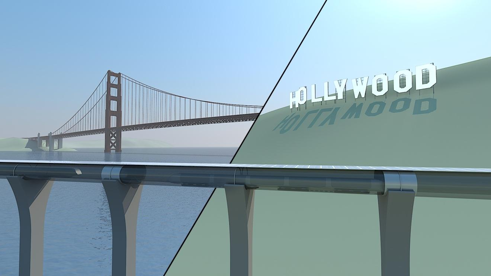

**Figure 3. Hyperloop tube stretching from Los Angeles to San Francisco.**

In  addition  to  these  aspects  of  the  Hyperloop,  safety  and  cost  will  also  be
addressed in this study.

The Hyperloop is sized to allow expansion as the network becomes increasingly
popular.  The  capacity  would  be  840  passengers  per  hour  which  more  than
sufficient  to  transport  all  of  the  6  million  passengers  traveling  between  Los
Angeles and San Francisco areas per year. In addition, this accounts for 70% of
those  travelers  to  use  the  Hyperloop  during  rush  hour.  The  lower  cost  of
traveling  on  Hyperloop  is  likely  to  result  in  increased  demand,  in  which  case
the time between capsule departures could be significantly shortened.

[capsule]**4.1. Capsule**

Two versions of the Hyperloop capsules are being considered: a passenger only
version and a passenger plus vehicle version.
 *Hyperloop Passenger Capsule *

Assuming  an  average  departure  time  of  2  minutes  between  capsules,  a
minimum of 28 passengers per capsule are required to meet 840 passengers per
hour. It is possible to further increase the Hyperloop capacity by reducing the
time  between  departures.  The  current  baseline  requires  up  to  40  capsules  in
activity  during  rush  hour,  6  of  which  are  at  the  terminals  for  loading  and
unloading of the passengers in approximately 5 minutes.

 *Hyperloop Passenger Plus Vehicle Capsule *

The passenger plus vehicle version of the Hyperloop will depart as often as the
passenger  only  version,  but  will  accommodate  3  vehicles  in  addition  to  the
passengers. All subsystems discussed in the following sections are featured on
both capsules.

For  travel  at  high  speeds,  the  greatest  power  requirement  is  normally  to
overcome air resistance. Aerodynamic drag increases with the square of speed,
and  thus  the  power  requirement  increases  with  the  cube  of  speed.  For
example,  to  travel  twice  as  fast  a  vehicle  must  overcome  four  times  the
aerodynamic resistance, and input eight times the power.

Just  as  aircraft  climb  to  high  altitudes  to  travel  through  less  dense  air,
Hyperloop encloses the capsules in a reduce pressure tube. The pressure of air
in Hyperloop is about 1/6 the pressure of the atmosphere on Mars.  This is an
operating pressure of 100 Pascals, which  reduces the drag force of the air by
1,000 times relative to sea level conditions and would be equivalent to flying
above  150,000  feet  altitude.  A  hard  vacuum  is  avoided  as  vacuums  are
expensive  and  difficult  to  maintain  compared  with  low  pressure  solutions.
Despite  the  low  pressure,  aerodynamic  challenges  must  still  be  addressed.
These include  managing the formation of shock waves when the speed of the
capsule  approaches  the  speed  of  sound,  and  the  air  resistance  increases
sharply.  Close  to  the  cities  where  more  turns  must  be  navigated,  capsules
travel at a lower speed. This reduces the accelerations felt by the passengers,
and  also  reduces  power  requirements  for  the  capsule.  The  capsules  travel  at
760 mph (1,220 kph, Mach 0.91 at 68 ºF or 20 ºC).

The proposed capsule geometry houses several distinct systems to reside within
the outer mold line[ (Figure 4).](hyperloop_alpha.html#12)

**Figure 4. Hyperloop passenger capsule subsystem
notional locations (not to scale).**

[capsule_geom]**4.1.1. Geometry**

In order to optimize the capsule speed and performance, the frontal area has
been  minimized  for  size  while  maintaining  passenger  comfort  [(Figure  5  ](hyperloop_alpha.html#13)and
[Figure 6).](hyperloop_alpha.html#14)

**Figure 5. Hyperloop passenger transport capsule conceptual design sketch.**

**Figure 6. Hyperloop passenger transport capsule conceptual design rendering.**

The  vehicle  is  streamlined  to  reduce  drag  and  features  a  compressor  at  the
leading  face  to  ingest  oncoming  air  for  levitation  and  to  a  lesser  extent
propulsion.  Aerodynamic  simulations  have  demonstrated  the  validity  of  this
‘compressor
within a tube’ concept [(Figure 7).](hyperloop_alpha.html#14)

**Figure 7. Streamlines for capsule traveling at high subsonic velocities inside Hyperloop.**

*Hyperloop Passenger Capsule *

The  maximum  width  is  4.43  ft  (1.35  m)  and  maximum  height  is  6.11  ft  (1.10
m). With rounded corners, this is equivalent to a 15 ft2 (1.4 m2) frontal area,
not including any propulsion or suspension components.

The  aerodynamic  power  requirements  at  700  mph  (1,130  kph)  is  around  only
134  hp  (100  kW)  with  a  drag  force  of  only  72  lbf  (320  N),  or  about  the  same

force as the weight of one oversized checked bag at the airport. The doors on
each  side  will  open  in  a  gullwing  (or  possibly  sliding)  manner  to  allow  easy
access during loading and unloading.  The luggage compartment will be at the
front or rear of the capsule.

The  overall  structure  weight  is  expected  to  be  near  6,800  lb  (3,100  kg)
including the luggage compartments and door mechanism. The overall cost of
the structure including
manufacturing is targeted to be no more than \$245,000.
 *Hyperloop Passenger Plus Vehicle Capsule *

The passenger plus vehicle version of the Hyperloop capsule has an increased
frontal  area  of  43  ft2  (4.0  m2),  not  including  any  propulsion  or  suspension
components.  This  accounts  for  enough  width  to  fit  a  vehicle  as  large  as  the
Tesla Model X.

The aerodynamic power requirement at 700 mph (1,130 kph) is around only 382
hp (285 kW) with a drag force of  205 lbf (910 N). The doors on each side will

open in a gullwing (or possibly sliding) manner to allow accommodate loading
of vehicles, passengers, or freight.

The  overall  structure  weight  is  expected  to  be  near  7,700  lb  (3,500  kg)
including the luggage compartments and door mechanism. The overall cost of
the structure including
manufacturing is targeted to be no more than \$275,000.

[capsule_interior]**4.1.2. Interior**

The  interior  of  the  capsule  is  specifically  designed  with  passenger  safety  and
comfort  in  mind.  The  seats  conform  well  to  the  body  to  maintain  comfort
during  the  high  speed  accelerations  experienced  during  travel.  Beautiful
landscape  will  be  displayed  in  the  cabin  and  each  passenger  will  have  access
their own personal entertainment system.
 *Hyperloop Passenger Capsule *

The Hyperloop passenger capsule [(Figure 8 ](hyperloop_alpha.html#16)and[ Figure 9) ](hyperloop_alpha.html#16)overall interior weight
is  expected  to  be  near  5,500  lb  (2,500  kg)  including  the  seats,  restraint
systems,  interior  and  door  panels,  luggage  compartments,  and  entertainment displays. The overall cost of the interior components is targeted to be no more
than \$255,000.

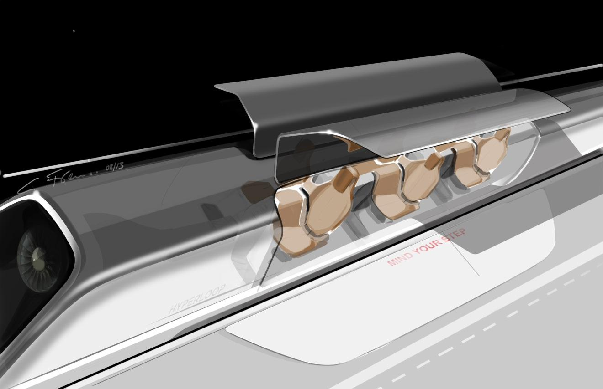

**Figure 8. Hyperloop passenger capsule version with doors open at
the station.**

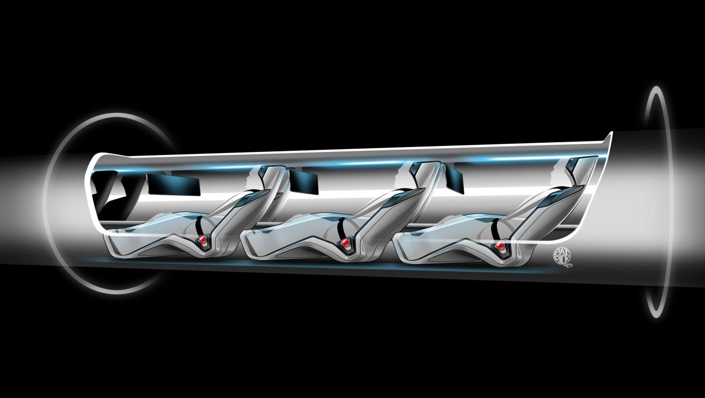

**Figure 9. Hyperloop passenger capsule version cutaway with passengers onboard.**
 *Hyperloop Passenger Plus Vehicle Capsule *

The  Hyperloop  passenger  plus  vehicle  capsule  overall  interior  weight  is
expected to be near 6,000 lb (2,700 kg) including the seats, restraint systems,
interior  and  door  panels,  luggage  compartments,  and  entertainment  displays.
The  overall  cost  of  the  interior  components  is  targeted  to  be  no  more  than
\$185,000.

[capsule_compressor]**4.1.3. Compressor**

One important feature of the capsule is the onboard compressor, which serves
two purposes. This system allows the capsule to traverse the relatively narrow
tube without choking flow that travels between the capsule and the tube walls
(resulting in  a  build-up  of  air  mass  in  front  of  the  capsule  and  increasing  the
drag) by compressing air that is bypassed through the capsule. It also supplies
air  to  air  bearings  that  support  the  weight  of  the  capsule  throughout  the
journey.

The  air  processing  occurs  as  follows  [(Figure  10  ](hyperloop_alpha.html#18)and  [Figure  11)  ](hyperloop_alpha.html#19)(note  mass
counting is tracked in Section 4.1.4):
 *Hyperloop Passenger Capsule *

1.  Tube  air  is  compressed  with  a  compression  ratio  of  20:1  via  an  axial
 compressor.
 2.  Up to 60% of this air is bypassed:

a.  The  air  travels  via  a  narrow  tube  near  bottom  of  the  capsule  to
 the tail.

b.  A nozzle at the tail expands the flow generating thrust to mitigate
 some of the small amounts of aerodynamic and bearing drag.

3.  Up to 0.44 lb/s (0.2 kg/s) of air is cooled and compressed an additional
 5.2:1 for the passenger version with additional cooling afterward.

a.  This air is stored in onboard composite overwrap pressure vessels.
b.  The  stored  air  is  eventually  consumed  by  the  air  bearings  to
 maintain distance between the capsule and tube walls.
 4.  An onboard water tank is used for cooling of the air.

a.  Water is pumped at 0.30 lb/s (0.14 kg/s) through two intercoolers
 (639 lb or 290 kg total mass of coolant).
 b.  The steam is stored onboard until reaching the station.
c.  Water and steam tanks are changed automatically at each stop.

5.  The  compressor  is  powered  by  a  436  hp  (325  kW)  onboard  electric
 motor:

a.  The  motor  has  an  estimated  mass  of  372  lb  (169  kg),  which
 includes power electronics.

b.  An estimated 3,400 lb (1,500 kg) of batteries provides 45 minutes

of  onboard  compressor  power,  which  is  more  than  sufficient  for
the travel time with added reserve backup power.

c.  Onboard  batteries  are  changed  at  each  stop  and  charged  at  the
 stations.

**Figure 10. Compressor schematic for passenger capsule.**
 *Hyperloop Passenger Plus Vehicle Capsule *

1.  Tube  air  is  compressed  with  a  compression  ratio  of  20:1  via  an  axial
 compressor.
 2.  Up to 85% of this air is bypassed:

a.  The  air  travels  via  a  narrow  tube  near  bottom  of  the  capsule  to
 the tail.

b.  A nozzle at the tail expands the flow generating thrust to mitigate
 some of the small amounts of aerodynamic and bearing drag.

3.  Up to 0.44 lb/s (0.2 kg/s) of air is cooled and compressed an additional

6.2:1  for  the  passenger  plus  vehicle  version  with  additional  cooling
afterward.

a.  This air is stored in onboard composite overwrap pressure vessels.
b.  The  stored  air  is  eventually  consumed  by  the  air  bearings  to
 maintain distance between the capsule and tube walls.

 4.  An onboard water tank is used for cooling of the air.

a.  Water is pumped at 0.86 lb/s (0.39 kg/s) through two intercoolers
 (1,800 lb or 818 kg total mass of coolant).
 b.  The steam is stored onboard until reaching the station.
c.  Water and steam tanks are changed automatically at each stop.

5.  The  compressor  is  powered  by  a  1,160  hp  (865  kW)  onboard  electric
 motor:

a.  The  motor  has  an  estimated  mass  of  606  lb  (275  kg),  which
 includes power electronics.

b.  An estimated 8,900 lb (4,000 kg) of batteries provides 45 minutes

of  onboard  compressor  power,  which  is  more  than  sufficient  for
the travel time with added reserve backup power.

c.  Onboard  batteries  are  changed  at  each  stop  and  charged  at  the
 stations.

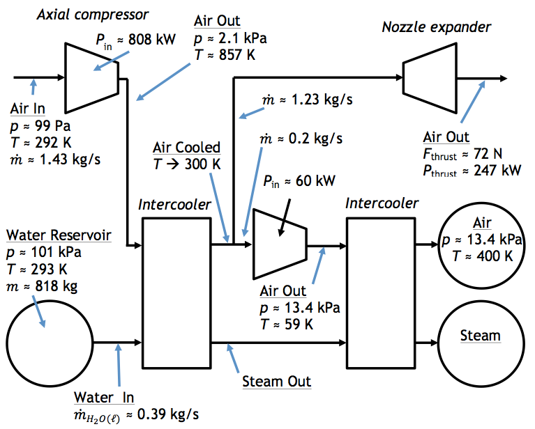

**Figure 11. Compressor schematic
for passenger plus vehicle capsule.**

[capsule_suspension]**4.1.4. Suspension**

Suspending  the  capsule  within  the  tube  presents  a  substantial  technical
challenge  due  to  transonic  cruising  velocities.  Conventional  wheel  and  axle
systems  become  impractical  at  high  speed  due  frictional  losses  and  dynamic
instability. A viable technical solution is magnetic levitation; however the cost
associated  with  material  and  construction  is  prohibitive.  An  alternative  to
these  conventional  options  is  an  air  bearing  suspension.  Air  bearings  offer
stability  and  extremely  low  drag  at  a  feasible  cost  by  exploiting  the  ambient
atmosphere in the tube.

**Figure 12: Schematic of
air bearing skis that support the capsule.**

Externally  pressurized  and  aerodynamic  air  bearings  are  well  suited  for  the
Hyperloop  due  to  exceptionally  high  stiffness,  which  is  required  to  maintain
stability at high speeds. When the gap height between a ski and the tube wall
is  reduced,  the  flow  field  in  the  gap  exhibits  a  highly  non-linear  reaction
resulting  in  large  restoring  pressures.  The  increased  pressure  pushes  the  ski
away  from  the  wall,  allowing  it  to  return  to  its  nominal  ride  height.  While  a
stiff air bearing suspension is superb for reliability and safety, it could create
considerable discomfort for passengers onboard. To account for this, each ski is
integrated into an independent mechanical suspension, ensuring a smooth ride
for  passengers.  The  capsule  may  also  include  traditional  deployable  wheels
similar to aircraft landing gear for ease of movement at speeds under 100 mph
(160 kph) and as a component of the overall safety system.
 *Hyperloop Passenger Capsule *

Hyperloop  capsules  will  float  above  the  tube’s  surface  on  an  array  of  28  air
bearing skis that are geometrically conformed to the tube walls. The skis, each
4.9  ft  (1.5  meters)  in  length  and  3.0  ft  (0.9  meters)  in  width,  support  the
weight of the capsule by floating on a pressurized cushion of air 0.020 to 0.050
in. (0.5 to 1.3 mm) off the ground. Peak pressures beneath the skis need only
reach  1.4  psi  (9.4  kPa)  to  support  the  passenger  capsule  (9%  of  sea  level
atmospheric  pressure).  The  skis  depend  on  two  mechanisms  to  pressurize  the
thin air film: external pressurization and aerodynamics.

The  aerodynamic  method  of  generating  pressure  under  the  air  bearings
becomes  appreciable  at  moderate  to  high  capsule  speeds.  As  the  capsule
accelerates up to cruising speed, the front tip of each ski is elevated relative
to the back tip such that the ski rests at a slight angle of 0.05º. Viscous forces
trap a thin film of air in the converging gap between the ski and the tube wall.
The  air  beneath  the  ski  becomes  pressurized  which  alters  the  flow  field  to
satisfy  fundamental  laws  of  mass,  momentum,  and  energy  conservation.  The
resultant elevated pressure beneath the ski relative to the ambient atmosphere
provides  a  net  lifting  force  that  is  sufficient  to  support  a  portion  of  the
capsule’s weight.

However,  the  pressure  field  generated  by  aerodynamics  is  not  sufficient  to
support the entire weight of the vehicle. At lower speeds, very little lift can be
generated  by  aerodynamic  mechanisms.  Temperature  and  density  in  the  fluid
film begin to rise more rapidly than pressure at high speeds, thus lift ceases to
increase as the capsule accelerates into the transonic regime.

Lift  is  supplemented  by  injecting  highly  pressurized  air  into  the  gap.  By
applying  an  externally  supplied  pressure,  a  favorable  pressure  distribution  is
established beneath the bearing and sufficient lift is generated to support the
capsule.  This  system  is  known  as  an  external  pressure  (EP)  bearing  and  it  is
effective  when  the  capsule  is  stationary  or  moving  at  very  high  speeds.  At
nominal  weight  and  g-loading,  a  capsule  on  the  Hyperloop  will  require  air
injection beneath the ski at a rate of  0.44 lb/s (0.2 kg/s) at 1.4 psi (9.4 kPa)
for the passenger capsule. The air is introduced via a network of grooves in the
bearing’s  bottom  surface  and  is  sourced  directly  from  the  high  pressure  air
reservoir onboard the capsule.

The  aerodynamically  and  externally  pressurized  film  beneath  the  skis  will
generate  a  drag  force  on  the  capsule.  The  drag  may  be  computed  by
recognizing that fluid velocity in the flow field is driven by both the motion of
the tube wall relative to the ski and by a pressure gradient, which is typically
referred  to  as  a  Couette-Poiseuille  flow.  Such  flows  are  well  understood, and
the  resultant  drag  can  be computed  analytically  (as  done in  this  alpha  study)
and improved and/or validated by computational methods. The predicted total
drag  generated  by  the  28  air  bearings  at  a  capsule  speed  of  760  mph  (1,220
kph) is 31 lbf (140 N), resulting in a 64 hp (48 kW) power loss.

The passenger capsule air bearing system weight is expected to be about 6,200
lb  (2,800  kg)  including  the  compressors,  air  tank,  plumbing,  suspension,  and
bearing surfaces. The overall cost of the air bearing components is targeted to
be no more than \$475,000.
 *Hyperloop Passenger Plus Vehicle Capsule *

The  passenger  plus  vehicle  version  of  the  Hyperloop  capsule  places  more
aggressive lifting requirements on the air bearings, but the expanded diameter
of the tube provides a greater surface area for lift generation. For this version,
an extra 12 in. (30 cm) of width would be added to each bearing. The nominal
air  supply  pressure  would  increase  to  1.6  psi  (11.2  kPa),  but  the  flow  rate
required would remain 0.44 lb/s (0.2 kg/s) thanks to the increased area under
the skis. Drag on the skis at 42 lbf (187 N), results in a power loss of 85 hp (63
 kW).

The passenger plus vehicle capsule air bearing system weight is expected to be
about  8,400  lb  (3,800  kg)  including  the  compressors,  air  tank,  plumbing,
suspension,  and  bearing  surfaces.  The  overall  cost  of  the  air  bearing
components is targeted to be no more than \$565,000.

[capsule_power]**4.1.5. Onboard Power**

The passenger capsule power system includes an estimated 5,500 lb (2,500 kg)
of batteries to power the onboard compressor and capsule systems in addition
to  the  compressor  motor  and  coolant.  The  battery,  motor,  and  electronic
components  cost  is  estimated  to  be  near  \$150,000  per  capsule  in  addition  to
the cost of the suspension system.

The passenger plus vehicle capsule power system includes an estimated 12,100
lb  (5,500  kg)  of  batteries  to  power  the  onboard  compressor  and  capsule
systems in addition to the compressor motor and coolant. The battery, motor
and electronic components cost is estimated to be near \$200,000 per
capsule in
addition to the cost of the suspension system.

[capsule_propulsion]**4.1.6. Propulsion**

In order to propel the vehicle at the required travel speed, an advanced linear
motor  system  is  being  developed  to  accelerate  the  capsule  above  760  mph
(1,220 kph) at a maximum of 1g for
comfort. The moving motor element (rotor)
will be located on the vehicle for weight savings and power requirements while
the tube will incorporate the stationary motor element (stator) which powers
the vehicle. More details can be found in the section 4.3.
 *Hyperloop Passenger Capsule *

The overall propulsion system weight attached to the capsule is expected to be
near 2,900 lb (1,300 kg) including the support and emergency braking system.
The overall cost of the  system is targeted to be no more than \$125,000. This
brings the total capsule weight near 33,000 lb (15,000 kg) including passenger
and luggage weight.
 *Hyperloop Passenger Plus Vehicle Capsule *

The overall propulsion system weight attached to the capsule is expected to be
near 3,500 lb (1,600 kg) including the support and emergency braking system.
The overall cost of the system is targeted to be no more than \$150,000. This
brings the total capsule weight near 57,000 lb (26,000) kg including passenger,
luggage, and vehicle weight.

[capsule_cost]**4.1.7. Cost**

The  overall  cost  of  the  Hyperloop  passenger  capsule  version  [(Table  1)  ](hyperloop_alpha.html#23)is
expected to be under \$1.35 million USD including manufacturing and assembly
cost.  With  40  capsules  required  for  the  expected  demand,  the  total  cost  of
capsules for the Hyperloop system should be no more than \$54 million USD or
approximately 1% of the total budget.

Although the overall cost of the project would be higher, we have also detailed
the  expected  cost  of  a  larger  capsule  [(Table  2)  ](hyperloop_alpha.html#23)which  could  carry  not  only
passengers  but  cargo  and  cars/SUVs  as  well.  The  frontal  area  of  the  capsule
would  have  to  be  increased  to  43  ft2  (4  m2)  and  the  tube  diameter  would  be
increased to 10 ft 10 in. (3.3 m).

**Table 1. Crew capsule weight and cost breakdown**

    Vehicle Component              Cost ($)     Weight (kg)
    Capsule Structure & Doors:   $   245,000      3100
    Interior & Seats:            $   255,000      2500
    Propulsion System:           $    75,000       700
    Suspension & Air Bearings:   $   200,000      1000
    Batteries, Motor & Coolant:  $   150,000      2500
    Air Compressor:              $   275,000      1800
    Emergency Braking:           $    50,000       600
    General Assembly:            $   100,000       N/A
    Passengers & Luggage:                N/A      2800

    Total/Capsule:               $ 1,350,000     15000

    Total for Hyperloop:         $54,000,000

**Table 2. Cargo and crew capsule weight and cost breakdown**

    Vehicle Component              Cost ($)    Weight (kg)
    Capsule Structure & Doors:   $   275,000      3500
    Interior & Seats:            $   185,000      2700
    Propulsion System:           $    80,000       800
    Suspension & Air Bearings:   $   265,000      1300
    Batteries, Motor & Coolant:  $   200,000      5500
    Air Compressor:              $   300,000      2500
    Emergency Braking:           $    70,000       800
    General Assembly:            $   150,000       N/A
    Passengers & Luggage:                N/A      1400
    Car & Cargo:                         N/A      7500
   
    Total/Capsule:               $ 1,525,000     26000

    Total for Hyperloop:         $61,000,000

[tube]**4.2. Tube**

The  main  Hyperloop  route  consists  of  a  partially  evacuated  cylindrical  tube
that  connects  the  Los  Angeles  and  San  Francisco  stations  in  a  closed  loop
system [(Figure 2).](hyperloop_alpha.html#10) The tube is specifically sized for optimal air flow around the
capsule improving performance and energy consumption at the expected travel
speed. The expected pressure inside the tube will be maintained around 0.015
psi  (100  Pa,  0.75  torr),  which  is  about  1/6  the  pressure  on  Mars.  This  low
pressure minimizes the drag force on the capsule while maintaining
the relative
ease of pumping out the air from the tube. The efficiency of industrial vacuum
pumps  decreases  exponentially  as  the  pressure  is  reduced  [(Figure  13),](hyperloop_alpha.html#24)  so
further  benefits  from  reducing  tube  pressure  would  be  offset  by  increased
pumping complexity.

**Figure 13. Typical vacuum pump
speed for functional pressure range.**

In order to minimize cost of the Hyperloop tube, it will be elevated on pillars
which greatly reduce the footprint required on the ground and the size of the
construction  area  required.  Thanks  to  the  small  pillar  footprint  and  by
maintaining the route as close as possible to currently operated highways, the
amount  of  land  required  for  the  Hyperloop  is  minimized.  More  details  are
available for the route in section 4.4.

The  Hyperloop  travel  journey  will  feel  very  smooth  since  the  capsule  will  be
guided directly on the inner surface of the tube via the use of air bearings and
suspension; this also prevents the need for costly tracks. The capsule will bank
off  the  walls  and  include  a  control  system  for  smooth  returns  to  nominal
capsule location from banking as well.  Some specific sections of the tube will
incorporate the stationary motor element (stator) which will  locally guide and
accelerate  (or  decelerate)  the  capsule.  More  details  are  available  for  the
propulsion  system  in  section  4.3.  Between  linear  motor  stations,  the  capsule
will glide with little drag via air bearings.

[tube_geom]**4.2.1. Geometry**

The  geometry  of  the  tube  depends  on  the  choice  of  either  the  passenger
version of Hyperloop or the passenger plus vehicles version of
Hyperloop.

In either case, if the speed of the air passing through the gaps accelerates  to
supersonic velocities, then shock waves form.  These waves limit how much air
can actually get out of the way of the capsule, building up a column of air in
front  of  its  nose  and  increasing  drag  until  the  air  pressure  builds  up
significantly  in  front  of  the  capsule.  With  the  increased  drag  and  additional
mass  of  air  to  push,  the  power  requirements  for  the  capsule  increase
significantly.  It  is  therefore  very  important  to  avoid  shock  wave  formation
around  the  capsule  by  careful  selecting  of  the  capsule/tube  area  ratio.  This
ensures sufficient mass air flow around and through the capsule at all operating
speeds. Any air that cannot pass around the annulus between the capsule and
tube is bypassed using the onboard compressor in each capsule.

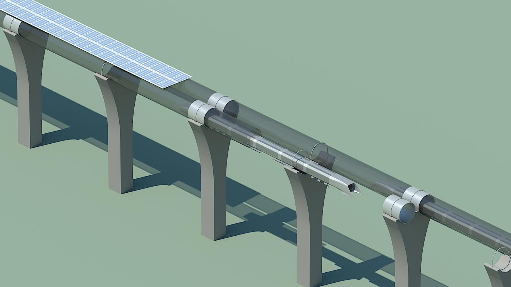

**Figure 14. Hyperloop capsule in tube cutaway with attached solar arrays.**
 *Passenger Hyperloop Tube *

The inner diameter of the tube is optimized to be 7 ft 4 in. (2.23 m) which is
small  enough  to  keep  material  cost  low  while  large  enough  to  provide  some
alleviation of
choked air flow around the capsule. The tube cross-sectional area
is 42.2 ft2 (3.91 m2) giving a capsule/tube area ratio of 36% or a diameter ratio
of  60%.  It  is  critical  to  the  aerodynamics  of  the  capsule  to  keep  this  ratio  as
large  as  possible, even  though the  pressure  in the tube is  extremely  low.    As
the capsule moves through the tube, it must displace its own volume of air, in
a  loosely  similar  way  to  a  boat  in  water.  The  displacement  of  the  air  is
constricted  by  the  walls  of  the  tube,  which  makes  it  accelerate  to  squeeze
through  the  gaps.  Any  flow  not  displaced  must  be  ingested  by  the  onboard
compressor of each capsule, which increases power requirements.

The closed loop tube will be mounted side by side on elevated pillars as seen in
Figure 5. The surface above the tubes will be lined with solar panels to provide
the required system energy. This represents a possible area of 14 ft (4.25 m)
wide for more than 350 miles (563 km) of tube length. With an expected solar
panel energy production of 0.015 hp/ft2 (120 W/m2), we can expect the system
to  produce  a  maximum  of  382,000  hp  (285**  **MW)  at  peak  solar  activity.  This
would actually be more energy than needed for the Hyperloop system and the
detailed power requirements will be detailed in section 4.3.
 *Passenger Plus Vehicle Hyperloop Tube *

The inner diameter of the tube is optimized to be 10 ft 10 in. (3.30 m), larger
than the passenger version to accommodate the larger capsule. The tube cross-
sectional area is 92.1 ft2 (8.55 m2) giving a capsule/tube area ratio of 47% or a
diameter ratio of 68%.

The closed passenger plus vehicle Hyperloop tube will be mounted side by side
in the same manner as the passenger version as seen in Figure 5. The surface
above the tubes will be lined with solar panels to provide the required system
energy. This represents a possible area of 22 ft (6.6 m) wide for more than 350
miles (563 km) of tube length. With an expected solar panel energy production
of 0.015 hp/ft2 (120W/m2), we can expect the system to produce a maximum
of  598,000  hp  (446**  **MW)  at  peak  solar  activity.  This  would  actually  be  more
energy  than  needed  for  the  passenger  plus  vehicle  Hyperloop  system  and  the
detailed power requirements will be detailed in section 4.3.
 *Station Connections *

The  stations  are  isolated  from  the  main  tube  as  much  as  possible  in  order  to
limit air leaks into the system. In addition, isolated branches  and stations off
the main tubes could be built to access some towns along the way between Los
Angeles  and  San  Francisco.  Vacuum  pumps  will  run  continuously  at  various
locations  along  the  length  of  the  tube  to  maintain  the  required  pressure
despite any possible leaks through the joint and stations. The expected cost of
all required vacuum pumps is expected to be no more than \$10 million USD.

[tube_construction]**4.2.2. Tube Construction

**In order to keep cost to a minimum, a uniform thickness steel tube reinforced
with  stringers  was  selected  as  the  material  of  choice  for  the  inner  diameter
tube  Tube  sections  would  be  pre-fabricated  and  installed  between  pillar
supports  spaced  100  ft  (30  m)  on  average,  varying  slightly  depending  on
location.  This  relatively  short  span  allows  keeping  tube  material  cost  and
deflection to a minimum.

The  steel  construction  allows  simple  welding  processes  to  join  different  tube
sections  together.  A  specifically  designed  cleaning  and  boring  machine  will
make it possible to surface finish the inside of the tube and welded joints for a
better  gliding  surface.  In  addition,  safety  emergency  exits  and  pressurization
ports will be added in key locations along the length of the tube.
 *Passenger Hyperloop Tube *

A  tube  wall  thickness  between  0.8  and  0.9  in.  (20  to  23  mm)  is  necessary  to
provide  sufficient  strength  for  the  load  cases  considered  such  as  pressure
differential, bending and buckling between pillars, loading due to the capsule
weight and acceleration, as well as seismic considerations.

The expected cost for the tube is expected to be less than \$650 million USD,
including  pre-fabricated  tube  sections  with  stringer  reinforcements  and
emergency  exits.  The  support  pillars  and  joints  which  will  be  detailed  in
section 4.2.3.
 *Passenger Plus Vehicle Hyperloop Tube *

The  tube  wall  thickness  for  the  larger  tube  would  be  between  0.9  and  1.0  in
(23 to 25 mm). Tube cost calculations were also made for the larger diameter
tube which would allow usage of the cargo and vehicle capsule in addition to
the passenger capsule. In that case, the expected cost for the tube is expected
to  be  less  than  \$1.2  billion  USD.  Since  the  spacing  between  pillars  would  not
change  and  the  pillars  are  more  expensive  than  the  tube,  the  overall  cost
increase is kept to a minimum.

[tube_pylons]**4.2.3. Pylons and Tunnels**

The tube will be supported by pillars which constrain the tube in the vertical
direction but allow longitudinal slip for thermal expansion as well as dampened
lateral slip to reduce the risk posed by earthquakes.  In addition, the pillar to
tube connection nominal position will be adjustable vertically and laterally to
ensure  proper  alignment  despite  possible  ground  settling.  These  minimally
constrained  pillars  to  tube  joints  will  also  allow  a  smoother  ride.  Specially
designed slip joints at each stations will be able take any tube length variance
due to thermal expansion. This is an ideal location for the thermal expansion
joints as the speed is much lower nearby the stations.
It thus allows the tube to
be smooth and welded along the high speed gliding middle section.
 The spacing of
the Hyperloop pillars retaining the tube is critical to achieve the
design  objective  of  the  tube  structure.  The  average  spacing  is  100  ft  (30  m),
which means there will be near 25,000 pillars supporting both tubes and solar
panels.  The pillars will be 20 ft (6 m) tall  whenever possible but may vary in
height in hilly areas or where obstacles are in the way. Also, in some key areas,
the  spacing  will  have  to  vary  in  order  to  pass  over  roads  or  other  obstacles.
Small spacing between each support reduces the deflection of the tube keeping
the  capsule  steadier  and  the  journey  more  enjoyable.  In  addition,  reduced
spacing  has  increased  resistance  to  seismic  loading  as  well  as  the  lateral
acceleration of the capsule.

Due to the sheer quantity of pillars required, reinforced concrete was selected
as the construction material due to its very low cost per volume. In some short
areas,  tunneling  may  be  required  to  avoid  going  over  mountains  and  to  keep
the route as straight as possible. The expected cost for the pillar construction
and  tube  joints  is  expected  to  be  no  more  than  \$2.55  billion  USD  for  the
passenger  version  tube  and  \$3.15  billion  USD  for  the  passenger  plus  vehicle
version  tube.  The  expected  cost  for  the  tunneling  is  expected  to  be  no  more
than \$600 million USD for the smaller diameter tube and near \$700 million USD
for the larger diameter tube.

Structural  simulations  [(Figure  15  ](hyperloop_alpha.html#28)through  [Figure  20)  ](hyperloop_alpha.html#31)have  demonstrated  the
capability  of  the  Hyperloop  to  withstand  atmospheric  pressure,  tube  weight,
earthquakes, winds, etc. Dampers will be incorporate between the pylons and
tubes to isolate movements in the ground from the tube.

**Figure 15. First mode shape of
Hyperloop at 2.71Hz (magnified x1500).**

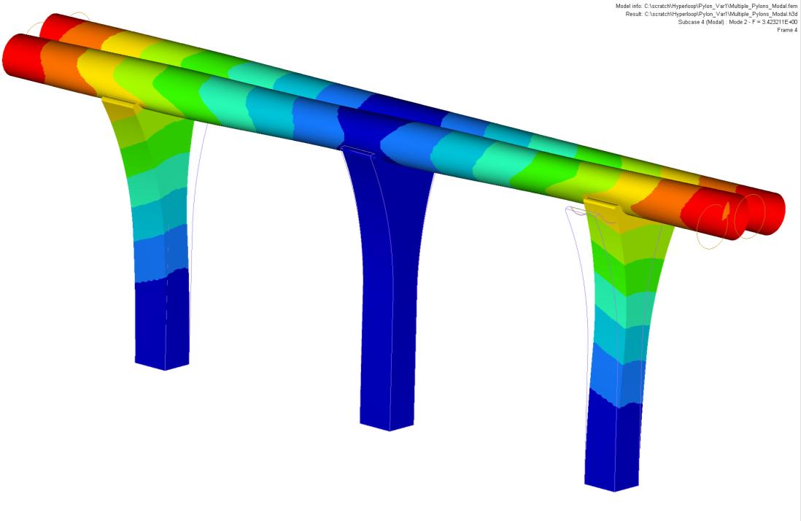

**Figure 16. Second mode shape of Hyperloop at
3.42Hz (magnified x1500).**

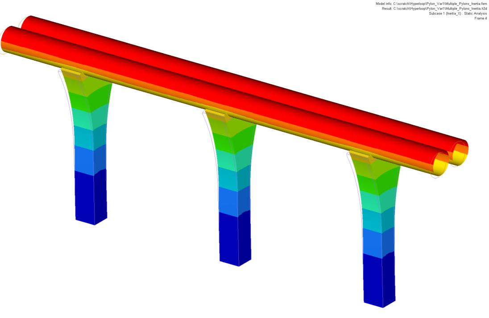

**Figure 17. Deformation at 1g Inertia in X (in.) (magnified x10).**

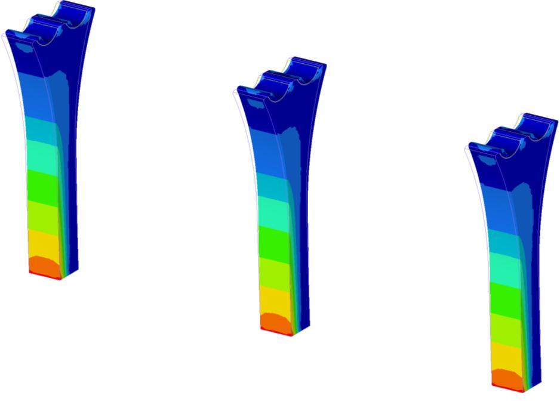

**Figure 18. Maximum
principal stress at 1g Inertia in X (psi) (magnified x10).**

**Figure 19.  Minimum principal stress at 1g Inertia in X (psi) (magnified x10).**

**Figure 20. Maximum
shear stress at 1g Inertia in X (psi) (magnified x10).**

[tube_station]**4.2.4. Station Construction**

The intention for Hyperloop stations is for them to be minimalist but practical
and with a boarding process and layout much simpler than airports.

Due to the short travel time and frequent departures, it is envisaged that there
will  be  a  continual  flow  of  passengers  through  each  Hyperloop  station,  in
contrast  to  the  pulsed  situation  at  airports  which  leads  to  lines  and  delays.
Safety and security are paramount, and so security checks will still be made in
a  similar  fashion  as  TSA  does  for  the  airport.  The  process  could  be  greatly
streamlined  to  reduce  wait  time  and  maintain  a  more  continuous  passenger
flow.

All  ticketing  and  baggage  tracking  for  the  Hyperloop  will  be  handled
electronically,  negating  the  need  for  printing  boarding  passes  and  luggage
labels.  Since Hyperloop travel time is very short, the main usage is more for
commuting  than  for  vacations.  There  would  be  a  luggage  limit  of  2  bags  per
person, for no more than 110 lb (50 kg) in total.  Luggage would be stowed in a
separate compartment at the rear of the capsule, in a way comparable to the
overhead  bins  on  passenger  aircraft.    This  luggage  compartment  can  be
removed  from  the  capsule,  so  that  the  process  of  stowing  and  retrieving
luggage  can  be  undertaken  separately  from  embarking  or  disembarking  the
capsule’s passenger
cabin. In addition, Hyperloop staff will take care of loading
and unloading passenger luggage in order to maximize efficiency.

The transit area at a Hyperloop terminal would be a large open area with two
large airlocks signifying the entry and exit points for the capsules.  An arriving
capsule would enter the incoming airlock, where the pressure is equalized with
the  station,  before  being  released  into  the  transit  area.    The  doors  of  the
capsule  would  open,  and  the  passengers  could  disembark.    The  luggage  pod
would  be  quickly  unloaded  by  the  Hyperloop  staff  or  separated  from  the
capsule  so  that  baggage  retrieval  would  not  interfere  with  the  capsule
turnaround.

Once vacated, the capsule would be rotated on a turntable, and aligned for re-
entry into the Hyperloop tube.  The departing passengers, and their pre-loaded
luggage pod, would then enter the capsule.  A Hyperloop attendant will then
perform  a  safety  check  of  each  passenger’s  seat  belts  before  the  capsule  is
cleared for departure.  At this point the capsule would then be moved forward
into  the exit  airlock, where  the  pressure is  lowered  to  the  operating  level  of
the  Hyperloop,  and  then  sent  on  its  way.  Note  that  loading  and  unloading
occurring in parallel with up to three capsules at a given station at any time.
The expected cost for each station is expected to be around \$125 million for a
total of \$250 million** **USD initially.

[tube_cost]**4.2.5. Cost

**The  overall  cost  of  the  tube,  pillars,  vacuum  pumps  and  stations  is  thus
expected  to  be  around  \$4.06  billion  USD  for  the  passenger  version  of
Hyperloop.  This  does  not  include  the  cost  of  the  propulsion  linear  motors  or
solar panels. The tube represents approximately 70% of
the total budget.

The  larger  10  ft  10  in.  (3.3  m)  tube  that  would  allow  the  cargo  and  vehicle
capsules  to  fit,  would  have  a  total  cost  including  the  tube,  pillars,  vacuum
pumps, and stations around \$5.31 billion USD. This minimal cost increase would
allow a much more versatile Hyperloop system.

[prop]**4.3. Propulsion**
 The propulsion system has these basic requirements:

1.  Accelerate  the  capsule  from  0  to  300  mph  (480  kph)  for  relatively  low
 speed travel in urban areas.
 2.  Maintain the capsule at 300 mph (480 kph) as necessary, including
during
 ascents over
the mountains surrounding Los Angeles and San Francisco.

3.  To accelerate the capsule from 300 to 760 mph (480 to 1,220 kph) at 1g
 at the beginning of the long coasting section along
the I-5 corridor.

4.  To decelerate the capsule back to 300 mph (480 kph) at the end of the I-
 5 corridor.

The Hyperloop as a whole is projected to consume an average of 28,000 hp (21
MW).  This  includes  the  power  needed  to  make  up  for  propulsion  motor
efficiency  (including  elevation  changes),  aerodynamic  drag,  charging  the
batteries to power on-board compressors, and vacuum pumps to keep the tube
evacuated.  A  solar  array  covering  the  entire  Hyperloop  is  large  enough  to
provide  an  annual  average  of  76,000  hp  (57  MW),  significantly  more  than  the
Hyperloop requires.

Since  the  peak  powers  of  accelerating  and  decelerating  capsules  are  up  to  3
times  the  average  power,  the  power  architecture  includes  a  battery  array  at
each  accelerator,  allowing  the  solar  array  to  provide  only  the  average  power
needed  to  run  the  system.  Power  from  the  grid  is  needed  only  when  solar
power is not available.

This section details a large linear accelerator, capable of the 300 to 760 mph
(480  to  1,220  kph)  acceleration  at  1g.  Smaller  accelerators  appropriate  for
urban  areas  and  ascending  mountain  ranges  can  be  scaled  down  from  this
system.

The Hyperloop uses a linear induction motor to accelerate and decelerate the
capsule.  This  provides  several  important  benefits  over  a  permanent  magnet
motor:

* Lower  material  cost  –  the  rotor  can  be  a  simple  aluminum  shape,  and
 does not require rare-earth elements.
* Lighter capsule.
* Smaller capsule dimensions.
* The lateral forces exerted by the stator on the rotor though low at 0.9

lbf/ft (13 N/m) are inherently stabilizing. This simplifies the problem of
 keeping the rotor aligned in the air gap.

**Figure 21. Rotor and stator 3D diagram**

Each  accelerator  has  two  65  MVA  inverters,  one  to  accelerate  the  outgoing
capsule, and one to capture the energy from the incoming capsule. Inverters in
the  10+  MVA  power  range  are  not  unusual  in  mining,  drives  for  large  cargo
ships,  and  railway  traction.  Moreover,  100+  MVA  drives  are  commercially
available.  Inexpensive  semiconductor  switches  allow  the  central  inverters  to
energize only the section of track occupied by a capsule, improving the power
factor seen by the inverters.

The  inverters  are  physically  located  at  the  highest  speed  end  of  the  track  to
minimize conductor cost.

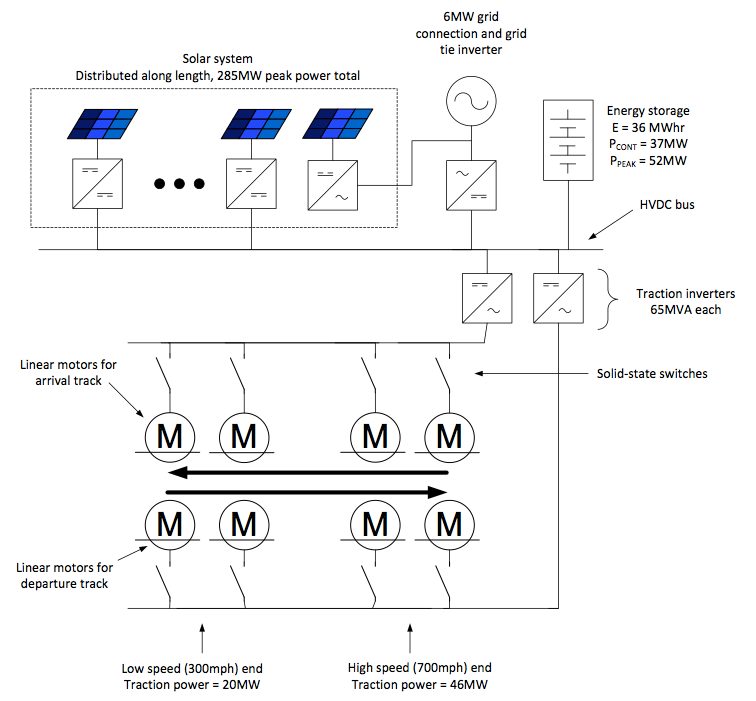

**Figure 22. Linear accelerator concept for capsule acceleration and deceleration between 300**

**and 760 mph (480 and 1,220 kph).**

[prop_rotor]**4.3.1. Capsule Components (Rotor)**

The  rotor  of  the  linear  accelerators  is  very simple  –  an  aluminum  blade  49  ft
(15 m) long, 1.5 ft (0.45 m) tall, and 2 in. (50 mm) thick. Current flows mainly
in the outer 0.4 in. (10 mm) of this blade, allowing it to be hollow to decrease
weight and cost.

The  gap  between the  rotor  and the  stator is  0.8  in. (20  mm)  on  each  side. A
combination  of  the  capsule  control  system  and  electromagnetic  centering
forces allows the capsule to safely enter, stay within, and exit such a precise
gap.

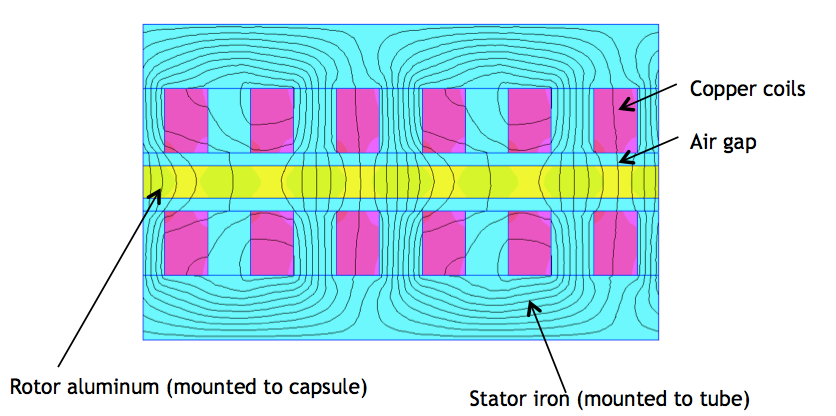

**Figure 23. Magnetic field strength inside linear induction motor**

[prop_stator]**4.3.2. Tube Components (Stator)**

The stator is mounted to the bottom of the tube over the entire 2.5 miles (4.0
km) it takes to accelerate and decelerate between 300 and 760 mph (480 and
1,220 km). It is approximately  1.6 ft (0.5 m) wide (including the air gap) and
4.0 in. (10 cm) tall, and weighs 530 lb/ft (800 kg/m).

Laid out symmetrically on each side of the rotor, its electrical configuration is
3-phase, 1 slot per pole per phase, with a variable linear pitch (1.3 ft or 0.4 m
maximum).  The  number  of  turns  per  slot  also  varies  along  the  length  of  the
stator, allowing the inverter
to operate at nearly constant phase voltage, which
simplifies  the  power  electronics  design.  The  two  halves  of  the  stator  require
bracing  to  resist  the  magnetic  forces  of  20  lbf/ft  (300N/m)  that  try  to  bring
 them together.

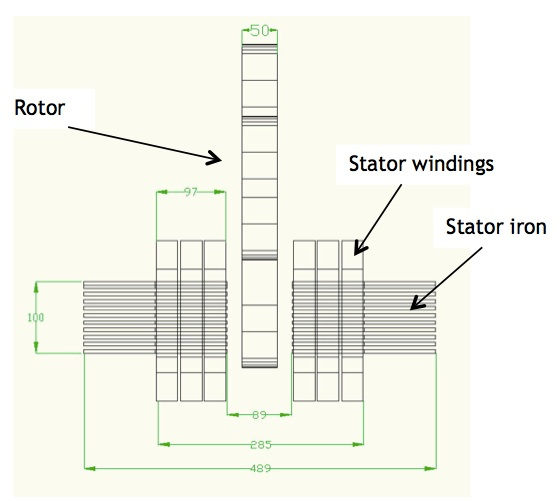

**Figure 24. Cross section of rotor inside stator**

[prop_energy]**4.3.3. Energy Storage Components**

Energy storage allows this linear accelerator to only draw its average power of
8,000 hp (6 MW) (rather than the peak power of 70,000 hp or 52 MW) from its
solar array.

Building the energy storage element out of the same lithium ion cells available
in  the  Tesla  Model  S  is  economical.  A  battery  array  with  enough  power
capability  to  provide  the  worst-case  smoothing  power  has  a  lot  of  energy  –
launching 1 capsule only uses 0.5% of the total energy – so degradation due to
cycling is not an issue. With proper construction and controls,
the battery could
be directly connected to the HVDC bus, eliminating the need for an additional
DC/DC converter to connect it to the propulsion system.

[prop_cost]**4.3.4. Cost**

As described above, the propulsion elements on the capsule are limited to the
rotor  and  not  expected  to  cost  any  more  than  \$3  million  USD  for  the  overall
system. The bulk of the propulsion cost is for the stator elements connected to
the  track  and  for  the  inverters  to  drive  the  stator.  All  tube-side  propulsion
costs together for linear accelerators add up to \$140 million USD.
 This cost is roughly divided as followed:
 -  Stator and structure materials = 54%
-  Power electronics (traction inverters, grid tie inverters) = 33%
-  Energy storage = 13%

The solar array and associated electronics provide an average power of 28,000
hp (21 MW) and are expected to cost approximately \$210 million USD.

[prop_passenger]**4.3.5. Propulsion for Passenger Plus Vehicle System**

Compared  to  the  passenger-only  capsule,  the  passenger  plus  vehicle  capsule
weighs more, requires a more powerful compressor, and has 50% higher total
drag. This increases both the peak and continuous power requirements on the
propulsion system, so that the Hyperloop now consumes an average of 66,000
hp (49 MW). However, there is still more than enough solar power available on
the wider tubes (122,000 hp or 91 MW, on average) to provide this.

The expected total cost for this larger propulsion system is \$691 million USD,
divided as follows:

*  66,000 hp (49 MW) (yearly average) solar array: \$490 million USD

*  Propulsion system total: \$200 million USD

*  Stator and structure materials = 47%

*  Power electronics = 37%

*  Energy storage = 16%

[route]**4.4. Route**

The  Hyperloop  will  be  capable  of  traveling  between  Los  Angeles  and  San
Francisco  in  approximately  35  minutes.  This  requirement  tends  to  size  other
portions of the system. Given the performance specification of the Hyperloop,
a  route  has  been  devised  to  satisfy  this  design  requirement.  The  Hyperloop
route should be based on several considerations, including:

1.  Maintaining the tube as closely as possible to existing rights of way (e.g., following the I-5).

2.  Limiting  the  maximum  capsule  speed  to  760  mph  (1,220  kph)  for aerodynamic considerations.

3.  Limiting accelerations on the passengers to 0.5g.

4.  Optimizing  locations  of  the  linear  motor  tube  sections  driving  the capsules.

5.  Local  geographical  constraints,  including  location  of  urban  areas,

mountain  ranges,  reservoirs,  national  parks,  roads,  railroads,  airports,
etc. The route must respect existing structures.

For  aerodynamic  efficiency,  the  velocity  of  a  capsule  in  the  Hyperloop  is
typically:

* 300 mph (480 kph) where local geography necessitates a tube bend radii
 \< 1.0 mile (1.6 km)

* 760  mph  (1,220  kph)  where  local  geography  allows  a  tube*  *bend  \>  3.0
 miles (4.8 km) or where local geography permits a straight tube.

These  bend  radii  have  been  calculated  so  that  the  passenger  does  not
experience  inertial  accelerations  that  exceed  0.5g.  This  is  deemed  the
maximum  inertial  acceleration  that  can  be  comfortably  sustained  by  humans
for  short  periods.  To  further  reduce  the  inertial  acceleration  experienced  by
passengers,  the  capsule  and/or  tube  will  incorporate  a  mechanism  that  will
allow a degree of ‘banking’.
 The Hyperloop route was created by the authors using Google Earth.

**Figure 25. Overview of Hyperloop route
from Los Angeles to San Francisco.**

[route_opt]**4.4.1. Route Optimization**

In  order  to  avoid  bend  radii  that  would  lead  to  uncomfortable  passenger
inertial accelerations and hence limit  velocity, it is necessary to optimize the
route.  This  can  be  achieved  by  deviating  from  the  current  highway  system,
earth removal, constructing
pylons to achieve elevation change or tunneling.
 The proposed route considers a combination of 20, 50, and 100 ft (6,
15, and 30
m,  respectively)  pylon  heights  to  raise  and  lower  the  Hyperloop  tube  over
geographical obstacles. A total tunnel length of 15.2 miles (24.5 km) has been
included  in  this  optimization  where  extreme  local  gradients  (\>6%)  would
preclude  the  use  of  pylons.  Tunneling  cost  estimations  are  estimated  at  \$50
million  per  mile  (\$31  million  per  km).  The  small  diameter  of  the  Hyperloop
tube should keep tunneling costs to a far
more reasonable level than traditional
automotive and rail tunnels.

 The route has been divided into the following sections:

* Los Angeles/Grapevine – South and North
* I-5
* I-580/San Francisco Bay

 *Summary*

*  300 mph (480 kph) for the Los Angeles Grapevine South section at 0.5g.
 Total time of 167 seconds

*  555 mph (890 kph) for the Los Angeles Grapevine North section at 0.5g.
 Total travel time of 435 seconds

*  760 mph (1,220 kph ) along I-5 at 0.5g.
 Total travel time of 1,518 seconds

*  555  mph  (890  kph)  along  I-580  slowing  to  300  mph  (480  kph)  into  San
 Francisco.

 Total travel time of 2,134 seconds (35 minutes)

The  velocity  [(Figure  26)  ](hyperloop_alpha.html#42)along  the  Hyperloop  and  distance  [(Figure  27)  ](hyperloop_alpha.html#43)as  a
function of time summarize the route.

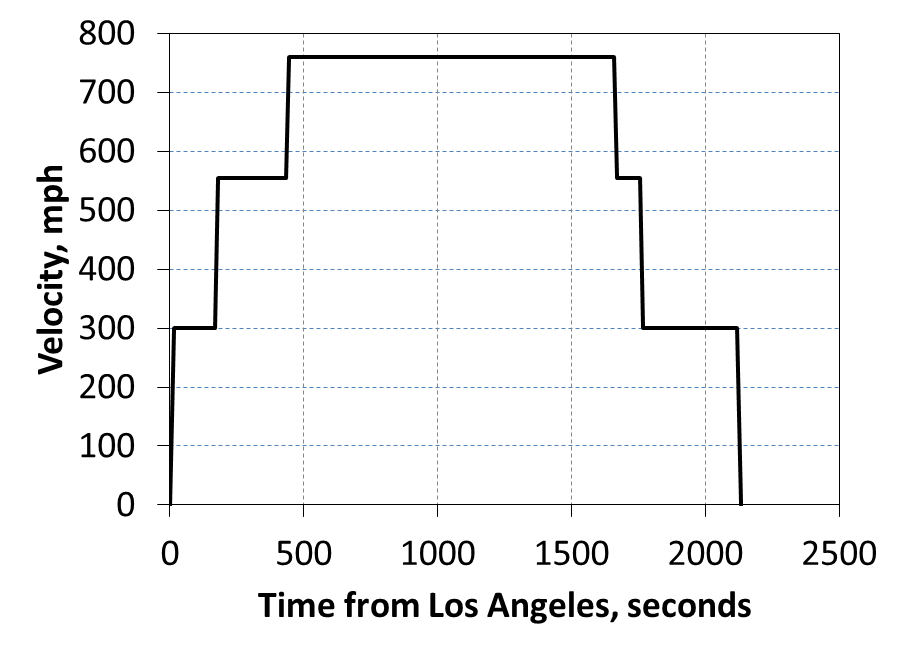

**Figure 26. Velocity of capsule as a function of time
from Los Angeles departure.**

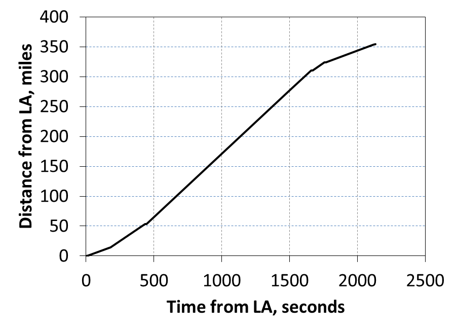

**Figure 27. Distance of capsule as a function of time
from Los Angeles departure.**

[route_la_s]**4.4.1.1. Los Angeles/Grapevine - South**

 *Visualization* -
 The  preliminary  route  is  shown  in  yellow.  Bend  radii  are
shown  in  red.  The  green  dashed  line  delineates  the
north/south Grapevine definition in this document.
 *Route* -
 Follows I-5 through Santa Clarita and Castaic.

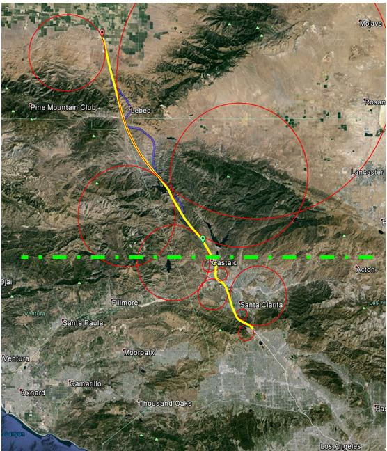

**Figure 28. Los Angeles/Grapevine South Section of
proposed Hyperloop route.**

**Table 3. Los Angeles/Grapevine South data at 300 mph (480 kph).**

    Criteria                    0.5g Acceleration
    Min. bend radius at        2.28 miles (3.67 km)
    300 mph (483 kph)
    Section Distance           13.4 miles (21.6 km)
    Journey time               167.6 seconds
    Tunnel distance            1.0 miles (1.61 km)
    No. of 20 ft (6 m)         563
    pylons
    No. of 50 ft (15 m)         80
    pylons
    No. of 100 ft (30 m)        12
    Pylons
    Additional length          1.20 miles (1.93 km)
    Required

[route_la_n]**4.4.1.2. Los Angeles/Grapevine – North**

 *Visualization* -
 The  preliminary  route  is  shown  in  yellow.  Bend  radii  are
shown  in  red.  The  green  dashed  line  delineates  the
north/south Grapevine definition in this document.
 *Route* -
 Significant  deviation  from  I-5  in  order  to  increase  bend
radius and develop straight sections.

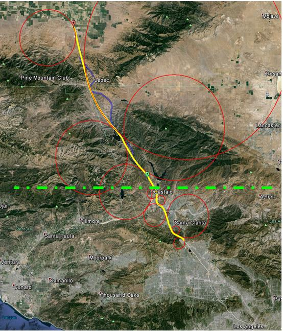

**Figure 29. Los Angeles/Grapevine North Section of
proposed Hyperloop route.**

**Table 4. Los Angeles/Grapevine North data at 555 mph (890 kph).**

    Criteria                   0.5g Acceleration
    Min. bend radius at        7.80 miles (12.6 km)
    555 mph (890 kph)
    Distance                   40.0 miles (64.4 km)
    Journey time               267.4 seconds
    Tunnel distance            10.7 miles (17.2 km)
    No. of 20 ft (6 m)         492
    Pylons
    No. of 50 ft (15 m)        260
    Pylons
    No. of 100 ft (30 m)       795
    Pylons
    Additional length          24 miles (38.6 km)
    required

[route_i5]**4.4.1.2. I-5**

 *Visualization* -
 The  preliminary  route  is  shown  in  yellow.  Bend  radii  are
shown in red.
 *Route* -
 Follows I-5 to minimize land/right of way purchase costs.

**Figure 30. I-5 Section of proposed Hyperloop route.**

**Table 5. I-5 Section data at 760 mph (1,120 kph).**

    Criteria                   0.5g Acceleration
    Min. bend radius at 760      14.6 miles (23.5 km)
    mph (1,220 kph)
    Distance                     227 miles (365 km)
    Journey time                 1,173.0 seconds
    Tunnel distance              0 miles (0 km)
    No. of 20 ft (6 m)           10,930
    pylons
    No. of 50 ft (15 m)          1,056
    pylons
    No. of 100 ft (30 m)         0
    pylons
    Additional length            14 miles (22.5 km)
    required

[route_i580]**4.4.1.3. I-580/San Francisco Bay**

 *Visualization* -
 The  preliminary  route  is  shown  in  yellow.  Bend  radii  are
shown in red.
 *Route* -
 Follows I-580 to minimize land/right of way purchase costs.
Deviation  from  I-580  West  of  Dublin  in  order  to  develop
straight sections.

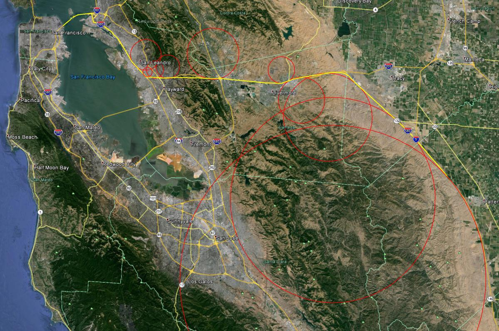

**Figure 31. I-580/San Francisco Bay Section of
proposed Hyperloop route.**

**Table 6. I-580/San Francisco Bay Section data at
300, 555, and 760 mph (480, 890, and 1,120 kph, respectively).**

    Criteria                  0.5g Acceleration
    Min. bend radius at        2.28 miles (3.67 km)
    300 mph (480 kph)
    Min. bend radius at        7.80 miles (12.55 km)
    555 mph (890 kph)
    Min. bend radius at        14.6 miles (23.5 km)
    760 mph (1,220 kph)
    Distance                   73.9 miles (119 km)
    Journey time               626.0 seconds
    Tunnel distance            3.5 miles (5.6 km)
    No. of 20 ft (6 m)         2,783
    pylons
    No. of 50 ft (15 m)        775
    pylons
    No. of 100 ft (30 m)       159
    pylons
    Additional length          5.7 miles (9.2 km)
    required

[route_stations]**4.4.3. Station Locations**

The  major  stations  for  Hyperloop  are  suggested  based  on  high  traffic  regions
between  major  cities.  The  largest  cities  by  metro  population  in  California
according  to  2010  to  2012  estimates  from  various  sources  [(Table  7)](hyperloop_alpha.html#50)  are
considered for station locations.

**Table 7. Largest cities in California by 2013 population.**

    City                   Population (millions)
    Los Angeles               18.1
    San Francisco/San Jose    8.4
    San Diego                 3.1
    Sacramento                2.6
    Fresno                    1.1

Stations at these major population centers are considered for Hyperloop.  One
additional  traffic  corridor  to  consider  is  between  Los  Angeles,  California  and
Las Vegas, Nevada with a metro population of 2.1 million. Significant traffic is
present through this corridor on a weekly basis.

**Figure 32. Suggested Hyperloop route map (map courtesy of
Google Maps).**

The  traffic  between  Los  Angeles,  California  and  San  Francisco/San  Jose,
California is estimated to be at least 6 million travelers per year. This possibly
represents the busiest corridor of travel in California. Travel along this corridor
is  anticipated  to  increase  with  completion  of  the  Hyperloop  due  to  both
decreased travel time and decreased travel cost.

Additional Hyperloop stations are suggested considered at the following major
population centers:

    1.  San Diego, California:

    a.  Connects to Los Angeles, California main station.
    b.  Capsule departures every 5 minutes.
    c.  Transports around 3 million people per year.

    2.  Las Vegas, Nevada:

    a.  Connects to Los Angeles, California main station.
    b.  Uses a portion of the San Diego branch route near Los Angeles and tube branches near San Bernardino, California.
    c.  Capsule departures every 8 minutes.
    d.  Transports around 1.8 million people per year.

    3.  Sacramento, California:

    a.  Connects to San Francisco, California main station.
    b.  Uses  a  portion  of  the  main  route  near  San  Francisco  and  tube branches near Stockton, California.
    c.  Capsule departures every 15 minutes.
    d.  Transports around 1 million people per year.

    4.  Fresno, California:

    a.  Connects  to  both  San  Francisco,  California  and  Los  Angeles, California main stations.
    b.  Los Angeles bound travelers:
        i.  Uses  the  main  route  closer  to  San  Francisco  plus  a  small branch along State Route 41 near Fresno.
        ii.  Capsule departures every 15 minutes.
        iii.  Transports around 1 million people per year.
    c.  San Francisco bound travelers:
        i.  Uses  the  main  route  closer  to  Los  Angeles  plus  a  small branch along State Route 41 near Fresno.
        ii.  Capsule departures every 30 minutes.
        iii.  Transports around 0.5 million people per year.

[safety]**4.5. Safety and Reliability**

The  design  of  Hyperloop  has  been  considered  from  the  start  with  safety  in
mind.    Unlike  other  modes  of  transport,  Hyperloop  is  a  single  system  that
incorporates the vehicle, propulsion system, energy management, timing, and
route.    Capsules  travel  in  a  carefully  controlled  and  maintained  tube
environment.    The  system  is  immune  to  wind,  ice,  fog,  and  rain.    The
propulsion  system  is  integrated  into  the  tube  and  can  only  accelerate  the
capsule to speeds that are safe in each section.  With human control error and
unpredictable  weather  removed  from  the  system,  very  few  safety  concerns
remain.

Some of the safety scenarios below are unique to the proposed system, but all
should be considered relative to other forms of transportation.  In many cases
Hyperloop is intrinsically safer than airplanes, trains, or
automobiles.** **

[safety_passenger]**4.5.1. Onboard Passenger Emergency**

All capsules would have direct radio contact with station operators in case of
emergencies,  allowing  passengers  to  report  any  incident,  to  request  help  and
to  receive  assistance.  In  addition,  all  capsules  would  be  fitted  with  first  aid
equipment.

The Hyperloop allows people to travel from San Francisco to LA in 30 minutes.
Therefore in case of emergency,
it is likely that the best course of action would
be for the capsule to communicate the situation to the station operator and for
the  capsule  to  finish  the  journey  in  a  few  minutes  where  emergency  services
would be waiting to assist.

Typical  times  between  an  emergency  and  access  to  a  physician  should  be
shorter than if an incident happened during airplane takeoff.
In the case of the
airplane, the route would need to be adjusted, other planes rerouted, runways
cleared, airplane landed, taxi to a gate, and doors opened.  An emergency in a
Hyperloop capsule simply requires the system to complete the planned journey
and meet emergency personnel at the destination.

[safety_power]**4.5.2. Power Outage**

The vast majority of the Hyperloop travel distance is spent coasting and so the
capsule does not require continuous power to travel. The capsule life support
systems  will  be  powered  by  two  or  more  redundant  lithium  ion  battery  pack
and so would be unaffected by a power outage. In the event of a power outage
occurring after a capsule had been launched, all linear accelerators would be
equipped  with  enough  energy  storage  to  bring  all  capsules  currently  in  the
Hyperloop  tube  safely  to  a  stop  at  their  destination.  In  addition,  linear
accelerators  using  the  same  storage  would  complete  the  acceleration  of  all
capsules  currently  in  the  tube.  For  additional  redundancy,  all  Hyperloop
capsules  would  be  fitted  with  a  mechanical  braking  system  to  bring  capsules
safely to a stop.

In summary, all journeys would be completed as expected from the passenger’s
perspective.    Normal  travel  schedules  would  be  resumed  after  power  was
restored.

[safety_capsule]**4.5.2. Capsule Depressurization**

Hyperloop  capsules  will  be  designed  to  the  highest  safety  standards  and
manufactured  with  extensive  quality  checks  to  ensure  their  integrity.  In  the
event  of  a  minor  leak,  the  onboard  environmental  control  system  would
maintain  capsule  pressure  using  the  reserve  air  carried  onboard  for  the  short
period  of  time  it  will  take  to  reach  the  destination.  In  the  case  of  a  more
significant depressurization,  oxygen  masks  would  be  deployed as  in  airplanes.
Once  the  capsule  reached  the  destination  safely  it  would  be  removed  from
service.  Safety of the onboard air supply in Hyperloop would be very similar to
aircraft, and can take advantage of decades of development in similar
systems.

In the unlikely event of a large scale capsule depressurization, other capsules
in the tube would automatically begin emergency braking whilst the Hyperloop
tube would undergo rapid re-pressurization along its entire length.

[safety_stranded]**4.5.3. Capsule Stranded in Tube**

A  capsule  becoming  stranded  in  the  Hyperloop  tube  is  highly  unlikely  as  the
capsule  coasts  the  majority  of  the  distance  at  high  speed  and  so  there  is  no
propulsion required for more than 90% of the journey.

If  a  capsule  were  somehow  to  become  stranded,  capsules  ahead  would
continue  their  journeys  to  the  destination  unaffected.  Capsules  behind  the
stranded  one  would  be  automatically  instructed  to  deploy  their  emergency
mechanical braking systems. Once all capsules behind the stranded capsule had
been  safely  brought  to  rest,  capsules  would  drive  themselves  to  safety  using
small onboard electric motors to power deployed wheels.

All  capsules  would  be  equipped  with  a  reserve  air  supply  great  enough  to
ensure the safety of all passengers for a worst case scenario event.

[safety_tube]**4.5.4. Structural Integrity of the Tube in Jeopardy**

A minor depressurization of the tube is unlikely to affect Hyperloop capsules or
passengers  and  would  likely  be  overcome  by  increased  vacuum  pump  power.
Any minor tube leaks could then be repaired during
standard maintenance.

In  the  event  of  a  large  scale  leak,  pressure  sensors  located  along  the  tube
would automatically communicate with all capsules to deploy their emergency
mechanical braking systems.

[safety_earth]**4.5.5. Earthquakes**

California is no stranger to earthquakes and transport systems and all built with
earthquakes  in  mind.  Hyperloop  would  be  no  different  with  the  entire  tube
length built with the necessary flexibility to withstand the earthquake motions
while maintaining the Hyperloop tube alignment.

It  is  also  likely  that  in  the  event  of  a  severe  earthquake,  Hyperloop  capsules
would be commanded remotely to actuate their mechanical emergency braking
systems.

[safety_human]**4.5.6. Human Related Incidents**

Hyperloop  would  feature  the  same  high  level  of  security  used  at  airports.
However,  the  regular  departure  of  Hyperloop  capsules  would  result  in  a
steadier and faster flow of passengers through security screening compared to
airports.  Tubes located on pylons would limit access to the critical elements of
the system.   Multiple redundant power sources and vacuum pumps would limit
the impact of any single element.

[safety_reliability]**4.5.7. Reliability**

The Hyperloop system comprising all infrastructure, mechanical,
electrical, and
software components will be designed so that it is reliable, durable, and fault
tolerant  over  its  service  life  (100  years),  while  maintaining  safety  levels  that
match or exceed the safety standard of
commercial air transportation.

[cost]**4.6. Cost**

The total cost of the Hyperloop passenger transportation system as outlined is
less  than  \$6  billion  USD  [(Table  8).](hyperloop_alpha.html#55)  The  passenger  plus  vehicle  version  of
Hyperloop is including both passenger and cargo capsules and the total cost is
outlined as \$7.5 billion USD[ (Table 9).](hyperloop_alpha.html#55)

**Table 8. Total cost of the Hyperloop passenger transportation system.**

    Component                 Cost (million USD)
    Capsule                      54 (40 capsules)
    Capsule Structure & Doors     9.8
    Interior & Seats             10.2
    Compressor & Plumbing        11
    Batteries & Electronics       6
    Propulsion                    5
    Suspension & Air Bearings     8
    Components Assembly           4

    Tube                      5,410
    Tube Construction           650
    Pylon Construction        2,550
    Tunnel Construction         600
    Propulsion                  140
    Solar Panels & Batteries    210
    Station & Vacuum Pumps      260
    Permits & Land            1,000

    Cost Margin                 536

    Total                     6,000

**Table 9. Total cost of the Hyperloop passenger plus vehicle transportation system.**

    Component                 Cost (million USD)
    Cargo Capsule                  30.5 (20 capsules)
    Capsule Structure & Doors       5.5
    Interior & Seats                3.7
    Compressor & Plumbing           6
    Batteries, Motor & Electronics  4
    Propulsion                      3
    Suspension & Air Bearings       5.3
    Components Assembly             3

    Passenger Only Capsule         40.5 (30 capsules)
    Capsule Structure & Doors       7.4
    Interior & Seats                7.6
    Compressor & Plumbing           8.2
    Batteries, Motor & Electronics  4.5
    Propulsion                      3.8
    Suspension & Air Bearings       6
    Components Assembly             3

    Tube                        7,000
    Tube Construction           1,200
    Pylon Construction          3,150
    Tunnel Construction           700
    Propulsion                    200
    Solar Panels & Batteries      490
    Station & Vacuum Pumps        260
    Permits & Land              1,000

    Cost Margin                   429

    Total                       7,500

[conclusions]**6. Conclusions**

A high speed transportation system known as Hyperloop has been developed in
this  document.  The  work  has  detailed  two  version  of  the  Hyperloop:  a
passenger  only  version  and  a  passenger  plus  vehicle  version.  Hyperloop  could
transport people, vehicles, and freight between Los Angeles and San Francisco
in  35  minutes.  Transporting  7.4  million  people  each  way  and  amortizing  the
cost of \$6 billion over 20 years gives a ticket price of \$20 for a one-way trip for
the passenger version of Hyperloop.  The passenger plus vehicle version of the
Hyperloop is less than 9% of the cost of the proposed passenger only high speed
rail system between Los Angeles and San Francisco.

An  additional  passenger  plus  transport  version  of  the  Hyperloop  has  been
created  that  is  only  25%  higher  in  cost  than  the  passenger  only  version.  This
version  would  be  capable  of  transport  passengers,  vehicles,  freight,  etc.  The
passenger plus vehicle version of the Hyperloop is less than 11% of the cost of
the  proposed  passenger  only  high  speed  rail  system  between  Los  Angeles  and
San Francisco. Additional technological developments and further optimization
could likely reduce this price.

The  intent  of  this  document  has  been  to  create  a  new  open  source  form  of
transportation that could revolutionize travel. The authors welcome feedback
and will incorporate it into future revisions of the Hyperloop project, following
other open source models such as Linux.

[future]**7. Future Work**

Hyperloop  is  considered  an  open  source  transportation  concept.  The  authors
encourage all members of
the community to contribute to the Hyperloop design
process. Iteration of the design by various individuals and groups can help bring
Hyperloop from an idea to a reality.

The authors recognize the need for additional work, including but not limited
to:

1.  More  expansion  on  the  control  mechanism  for  Hyperloop  capsules,
 including attitude thruster or control moment gyros.

2.  Detailed  station  designs  with  loading  and  unloading  of  both  passenger
 and passenger plus vehicle versions of the Hyperloop capsules.

3.  Trades  comparing  the  costs  and  benefits  of  Hyperloop  with  more
 conventional magnetic levitation systems.

4.  Sub-scale  testing  based  on  a  further  optimized  design  to  demonstrate
 the physics of Hyperloop.

Feedback is welcomed on these or any useful aspects of the Hyperloop design.
E-mail feedback to[ hyperloop@spacex.com ](mailto:hyperloop@spacex.com)o[r hyperloop@teslamotors.com.](mailto:hyperloop@teslamotors.com)
