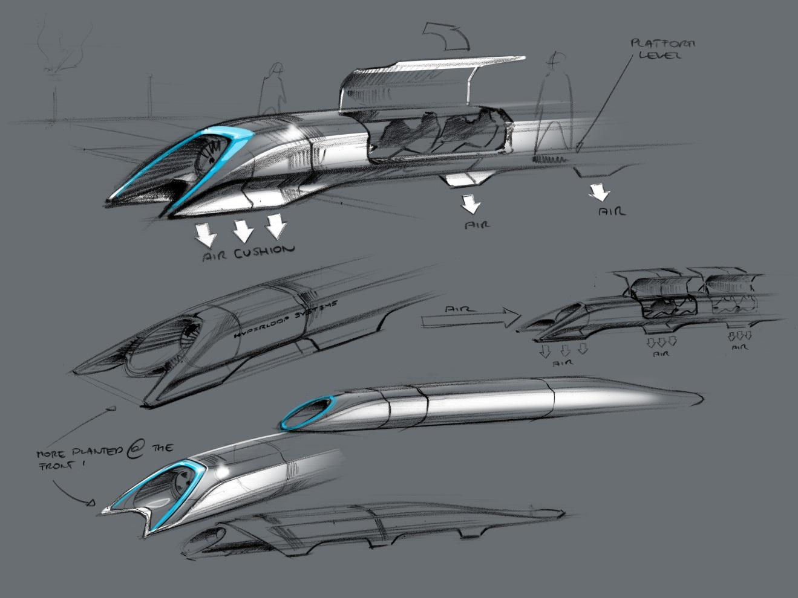
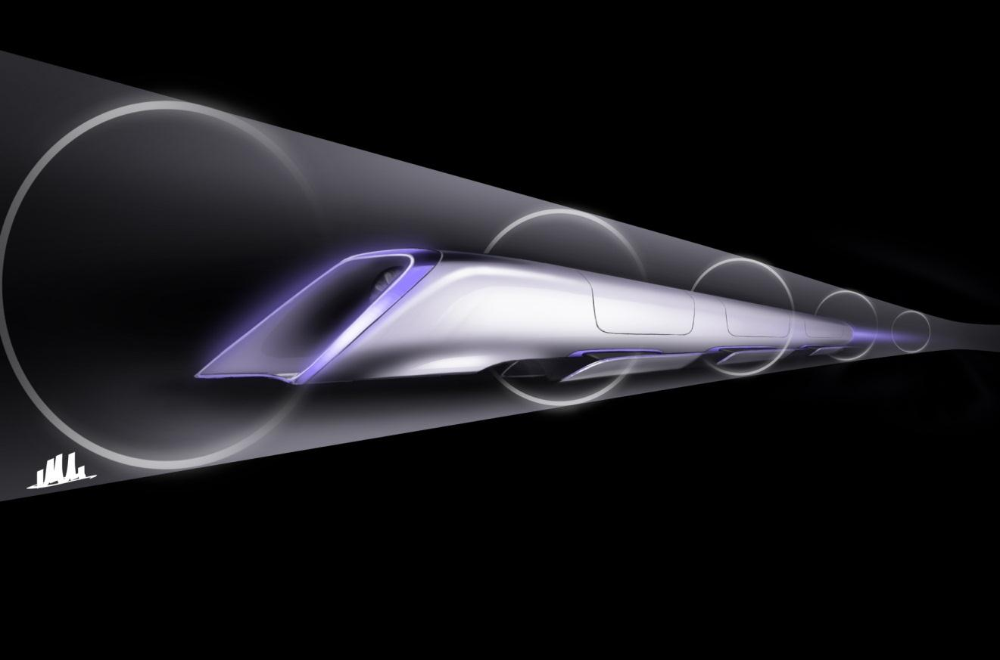
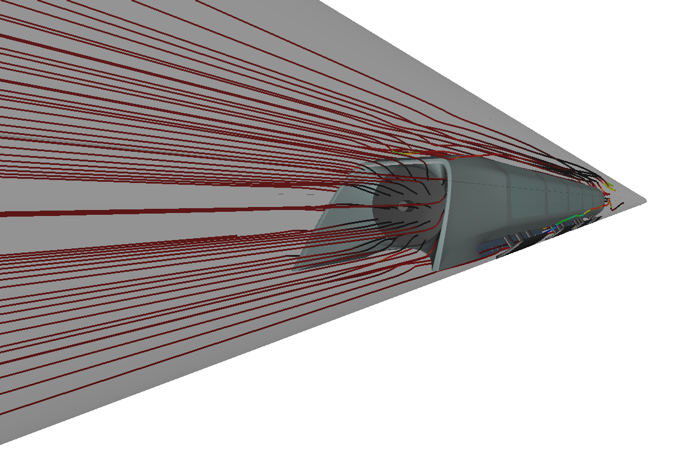
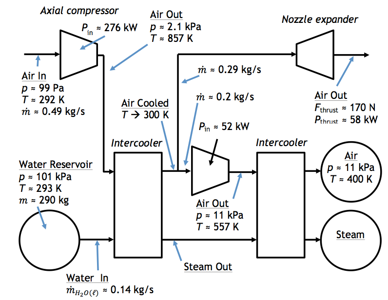
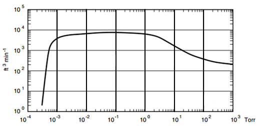

**4.1. Capsule**

Two versions of the Hyperloop capsules are being considered: a passenger only
version and a passenger plus vehicle version.
 *Hyperloop Passenger Capsule *

Assuming  an  average  departure  time  of  2  minutes  between  capsules,  a
minimum of 28 passengers per capsule are required to meet 840 passengers per
hour. It is possible to further increase the Hyperloop capacity by reducing the
time  between  departures.  The  current  baseline  requires  up  to  40  capsules  in
activity  during  rush  hour,  6  of  which  are  at  the  terminals  for  loading  and
unloading of the passengers in approximately 5 minutes.

 *Hyperloop Passenger Plus Vehicle Capsule *

* * * * *

The passenger plus vehicle version of the Hyperloop will depart as often as the
passenger  only  version,  but  will  accommodate  3  vehicles  in  addition  to  the
passengers. All subsystems discussed in the following sections are featured on
both capsules.

For  travel  at  high  speeds,  the  greatest  power  requirement  is  normally  to
overcome air resistance. Aerodynamic drag increases with the square of speed,
and  thus  the  power  requirement  increases  with  the  cube  of  speed.  For
example,  to  travel  twice  as  fast  a  vehicle  must  overcome  four  times  the
aerodynamic resistance, and input eight times the power.

Just  as  aircraft  climb  to  high  altitudes  to  travel  through  less  dense  air,
Hyperloop encloses the capsules in a reduce pressure tube. The pressure of air
in Hyperloop is about 1/6 the pressure of the atmosphere on Mars.  This is an
operating pressure of 100 Pascals, which  reduces the drag force of the air by
1,000 times relative to sea level conditions and would be equivalent to flying
above  150,000  feet  altitude.  A  hard  vacuum  is  avoided  as  vacuums  are
expensive  and  difficult  to  maintain  compared  with  low  pressure  solutions.
Despite  the  low  pressure,  aerodynamic  challenges  must  still  be  addressed.
These include  managing the formation of shock waves when the speed of the
capsule  approaches  the  speed  of  sound,  and  the  air  resistance  increases
sharply.  Close  to  the  cities  where  more  turns  must  be  navigated,  capsules
travel at a lower speed. This reduces the accelerations felt by the passengers,
and  also  reduces  power  requirements  for  the  capsule.  The  capsules  travel  at
760 mph (1,220 kph, Mach 0.91 at 68 ºF or 20 ºC).

The proposed capsule geometry houses several distinct systems to reside within
the outer mold line[ (Figure 4).](hyperloop_alpha.html#12)

 Inlet
 Compressor

 Compressor
 Batteries
 fan
 motor
 Firewall/
 Seating  Suspension
 Air storage

 sound bulkhead  (2 x 14)

**Figure 4. Hyperloop passenger capsule subsystem
notional locations (not to scale).**

* * * * *

**4.1.1. Geometry**

In order to optimize the capsule speed and performance, the frontal area has
been  minimized  for  size  while  maintaining  passenger  comfort  [(Figure  5  ](hyperloop_alpha.html#13)and
[Figure 6).](hyperloop_alpha.html#14)

**Figure 5. Hyperloop passenger transport capsule conceptual design sketch.**

* * * * *

**Figure 6. Hyperloop passenger transport capsule conceptual design rendering.**

The  vehicle  is  streamlined  to  reduce  drag  and  features  a  compressor  at  the
leading  face  to  ingest  oncoming  air  for  levitation  and  to  a  lesser  extent
propulsion.  Aerodynamic  simulations  have  demonstrated  the  validity  of  this
‘compressor
within a tube’ concept [(Figure 7).](hyperloop_alpha.html#14)

**Figure 7. Streamlines for capsule traveling at high subsonic velocities inside Hyperloop.**

* * * * *

*Hyperloop Passenger Capsule *

The  maximum  width  is  4.43  ft  (1.35  m)  and  maximum  height  is  6.11  ft  (1.10
m). With rounded corners, this is equivalent to a 15 ft2 (1.4 m2) frontal area,
not including any propulsion or suspension components.

The  aerodynamic  power  requirements  at  700  mph  (1,130  kph)  is  around  only
134  hp  (100  kW)  with  a  drag  force  of  only  72  lbf  (320  N),  or  about  the  same

force as the weight of one oversized checked bag at the airport. The doors on
each  side  will  open  in  a  gullwing  (or  possibly  sliding)  manner  to  allow  easy
access during loading and unloading.  The luggage compartment will be at the
front or rear of the capsule.

The  overall  structure  weight  is  expected  to  be  near  6,800  lb  (3,100  kg)
including the luggage compartments and door mechanism. The overall cost of
the structure including
manufacturing is targeted to be no more than \$245,000.
 *Hyperloop Passenger Plus Vehicle Capsule *

The passenger plus vehicle version of the Hyperloop capsule has an increased
frontal  area  of  43  ft2  (4.0  m2),  not  including  any  propulsion  or  suspension
components.  This  accounts  for  enough  width  to  fit  a  vehicle  as  large  as  the
Tesla Model X.

The aerodynamic power requirement at 700 mph (1,130 kph) is around only 382
hp (285 kW) with a drag force of  205 lbf (910 N). The doors on each side will

open in a gullwing (or possibly sliding) manner to allow accommodate loading
of vehicles, passengers, or freight.

The  overall  structure  weight  is  expected  to  be  near  7,700  lb  (3,500  kg)
including the luggage compartments and door mechanism. The overall cost of
the structure including
manufacturing is targeted to be no more than \$275,000.

**4.1.2. Interior**

The  interior  of  the  capsule  is  specifically  designed  with  passenger  safety  and
comfort  in  mind.  The  seats  conform  well  to  the  body  to  maintain  comfort
during  the  high  speed  accelerations  experienced  during  travel.  Beautiful
landscape  will  be  displayed  in  the  cabin  and  each  passenger  will  have  access
their own personal entertainment system.
 *Hyperloop Passenger Capsule *

The Hyperloop passenger capsule [(Figure 8 ](hyperloop_alpha.html#16)and[ Figure 9) ](hyperloop_alpha.html#16)overall interior weight
is  expected  to  be  near  5,500  lb  (2,500  kg)  including  the  seats,  restraint
systems,  interior  and  door  panels,  luggage  compartments,  and  entertainment displays. The overall cost of the interior components is targeted to be no more
than \$255,000.

**Figure 8. Hyperloop passenger capsule version with doors open at
the station.**

**Figure 9. Hyperloop passenger capsule version cutaway with passengers onboard.**
 *Hyperloop Passenger Plus Vehicle Capsule *

* * * * *

The  Hyperloop  passenger  plus  vehicle  capsule  overall  interior  weight  is
expected to be near 6,000 lb (2,700 kg) including the seats, restraint systems,
interior  and  door  panels,  luggage  compartments,  and  entertainment  displays.
The  overall  cost  of  the  interior  components  is  targeted  to  be  no  more  than
\$185,000.

**4.1.3. Compressor**

One important feature of the capsule is the onboard compressor, which serves
two purposes. This system allows the capsule to traverse the relatively narrow
tube without choking flow that travels between the capsule and the tube walls
(resulting in  a  build-up  of  air  mass  in  front  of  the  capsule  and  increasing  the
drag) by compressing air that is bypassed through the capsule. It also supplies
air  to  air  bearings  that  support  the  weight  of  the  capsule  throughout  the
journey.

The  air  processing  occurs  as  follows  [(Figure  10  ](hyperloop_alpha.html#18)and  [Figure  11)  ](hyperloop_alpha.html#19)(note  mass
counting is tracked in Section 4.1.4):
 *Hyperloop Passenger Capsule *

1.  Tube  air  is  compressed  with  a  compression  ratio  of  20:1  via  an  axial
 compressor.
 2.  Up to 60% of this air is bypassed:

a.  The  air  travels  via  a  narrow  tube  near  bottom  of  the  capsule  to
 the tail.

b.  A nozzle at the tail expands the flow generating thrust to mitigate
 some of the small amounts of aerodynamic and bearing drag.

3.  Up to 0.44 lb/s (0.2 kg/s) of air is cooled and compressed an additional
 5.2:1 for the passenger version with additional cooling afterward.

a.  This air is stored in onboard composite overwrap pressure vessels.
b.  The  stored  air  is  eventually  consumed  by  the  air  bearings  to
 maintain distance between the capsule and tube walls.
 4.  An onboard water tank is used for cooling of the air.

a.  Water is pumped at 0.30 lb/s (0.14 kg/s) through two intercoolers
 (639 lb or 290 kg total mass of coolant).
 b.  The steam is stored onboard until reaching the station.
c.  Water and steam tanks are changed automatically at each stop.

5.  The  compressor  is  powered  by  a  436  hp  (325  kW)  onboard  electric
 motor:

a.  The  motor  has  an  estimated  mass  of  372  lb  (169  kg),  which
 includes power electronics.

b.  An estimated 3,400 lb (1,500 kg) of batteries provides 45 minutes

of  onboard  compressor  power,  which  is  more  than  sufficient  for
the travel time with added reserve backup power.

* * * * *

c.  Onboard  batteries  are  changed  at  each  stop  and  charged  at  the
 stations.

 *Axial compressor*

 Air Out

 *Nozzle expander*

    *P * ≈ 276 kW
    *p* ≈ 2.1 kPa
    in

    *T* ≈ 857 K
    𝑚  ≈ 0.29 kg/s

 Air In

    *p* ≈ 99 Pa
    *T* ≈ 292 K
    𝑚  ≈ 0.2 kg/s

 Air Out

 Air Cooled

    𝑚  ≈ 0.49 kg/s

    *F*thrust ≈ 170 N
    *T*  300 K
    *P*

    *P*
    thrust ≈ 58 kW
    in ≈ 52 kW

 *Intercooler*

 *Intercooler*

 Air

 Water Reservoir

    *p* ≈ 11 kPa
    *p* ≈ 101 kPa
    *T* ≈ 400 K
    *T* ≈ 293 K
   𝑚 ≈ 290 kg

 Air Out

    *p* ≈ 11 kPa

    *T* ≈ 557 K

  Steam

 Steam Out

 Water  In

    𝑚 𝐻2𝑂 ℓ  ≈ 0.14 kg/s

**Figure 10. Compressor schematic for passenger capsule.**
 *Hyperloop Passenger Plus Vehicle Capsule *

1.  Tube  air  is  compressed  with  a  compression  ratio  of  20:1  via  an  axial
 compressor.
 2.  Up to 85% of this air is bypassed:

a.  The  air  travels  via  a  narrow  tube  near  bottom  of  the  capsule  to
 the tail.

b.  A nozzle at the tail expands the flow generating thrust to mitigate
 some of the small amounts of aerodynamic and bearing drag.

3.  Up to 0.44 lb/s (0.2 kg/s) of air is cooled and compressed an additional

6.2:1  for  the  passenger  plus  vehicle  version  with  additional  cooling
afterward.

a.  This air is stored in onboard composite overwrap pressure vessels.
b.  The  stored  air  is  eventually  consumed  by  the  air  bearings  to
 maintain distance between the capsule and tube walls.

* * * * *

 4.  An onboard water tank is used for cooling of the air.

a.  Water is pumped at 0.86 lb/s (0.39 kg/s) through two intercoolers
 (1,800 lb or 818 kg total mass of coolant).
 b.  The steam is stored onboard until reaching the station.
c.  Water and steam tanks are changed automatically at each stop.

5.  The  compressor  is  powered  by  a  1,160  hp  (865  kW)  onboard  electric
 motor:

a.  The  motor  has  an  estimated  mass  of  606  lb  (275  kg),  which
 includes power electronics.

b.  An estimated 8,900 lb (4,000 kg) of batteries provides 45 minutes

of  onboard  compressor  power,  which  is  more  than  sufficient  for
the travel time with added reserve backup power.

c.  Onboard  batteries  are  changed  at  each  stop  and  charged  at  the
 stations.

 *Axial compressor*
 Air Out

 *Nozzle expander*

    *P * ≈ 808 kW
    *p* ≈ 2.1 kPa
    in
    *T* ≈ 857 K
    𝑚  ≈ 1.23 kg/s

 Air In

    *p* ≈ 99 Pa
    *T* ≈ 292 K
    𝑚  ≈ 0.2 kg/s

 Air Out

 Air Cooled

    𝑚  ≈ 1.43 kg/s
    *F*thrust ≈ 72 N
    *T*  300 K
    *P*

    *P*
    thrust ≈ 247 kW
    in ≈ 60 kW

 *Intercooler*

 *Intercooler*

 Air

 Water Reservoir

    *p* ≈ 13.4 kPa
    *p* ≈ 101 kPa
    *T* ≈ 400 K
    *T* ≈ 293 K
   𝑚 ≈ 818 kg
 Air Out

    *p* ≈ 13.4 kPa
    *T* ≈ 59 K

  Steam

 Steam Out

 Water  In

    𝑚 𝐻2𝑂 ℓ  ≈ 0.39 kg/s

**Figure 11. Compressor schematic
for passenger plus vehicle capsule.**

* * * * *

**4.1.4. Suspension**

Suspending  the  capsule  within  the  tube  presents  a  substantial  technical
challenge  due  to  transonic  cruising  velocities.  Conventional  wheel  and  axle
systems  become  impractical  at  high  speed  due  frictional  losses  and  dynamic
instability. A viable technical solution is magnetic levitation; however the cost
associated  with  material  and  construction  is  prohibitive.  An  alternative  to
these  conventional  options  is  an  air  bearing  suspension.  Air  bearings  offer
stability  and  extremely  low  drag  at  a  feasible  cost  by  exploiting  the  ambient
atmosphere in the tube.

**Figure 12: Schematic of
air bearing skis that support the capsule.**

Externally  pressurized  and  aerodynamic  air  bearings  are  well  suited  for  the
Hyperloop  due  to  exceptionally  high  stiffness,  which  is  required  to  maintain
stability at high speeds. When the gap height between a ski and the tube wall
is  reduced,  the  flow  field  in  the  gap  exhibits  a  highly  non-linear  reaction
resulting  in  large  restoring  pressures.  The  increased  pressure  pushes  the  ski
away  from  the  wall,  allowing  it  to  return  to  its  nominal  ride  height.  While  a
stiff air bearing suspension is superb for reliability and safety, it could create
considerable discomfort for passengers onboard. To account for this, each ski is
integrated into an independent mechanical suspension, ensuring a smooth ride
for  passengers.  The  capsule  may  also  include  traditional  deployable  wheels
similar to aircraft landing gear for ease of movement at speeds under 100 mph
(160 kph) and as a component of the overall safety system.
 *Hyperloop Passenger Capsule *

Hyperloop  capsules  will  float  above  the  tube’s  surface  on  an  array  of  28  air
bearing skis that are geometrically conformed to the tube walls. The skis, each
4.9  ft  (1.5  meters)  in  length  and  3.0  ft  (0.9  meters)  in  width,  support  the
weight of the capsule by floating on a pressurized cushion of air 0.020 to 0.050
in. (0.5 to 1.3 mm) off the ground. Peak pressures beneath the skis need only
reach  1.4  psi  (9.4  kPa)  to  support  the  passenger  capsule  (9%  of  sea  level
atmospheric  pressure).  The  skis  depend  on  two  mechanisms  to  pressurize  the
thin air film: external pressurization and aerodynamics.

The  aerodynamic  method  of  generating  pressure  under  the  air  bearings
becomes  appreciable  at  moderate  to  high  capsule  speeds.  As  the  capsule
accelerates up to cruising speed, the front tip of each ski is elevated relative

* * * * *

to the back tip such that the ski rests at a slight angle of 0.05º. Viscous forces
trap a thin film of air in the converging gap between the ski and the tube wall.
The  air  beneath  the  ski  becomes  pressurized  which  alters  the  flow  field  to
satisfy  fundamental  laws  of  mass,  momentum,  and  energy  conservation.  The
resultant elevated pressure beneath the ski relative to the ambient atmosphere
provides  a  net  lifting  force  that  is  sufficient  to  support  a  portion  of  the
capsule’s weight.

However,  the  pressure  field  generated  by  aerodynamics  is  not  sufficient  to
support the entire weight of the vehicle. At lower speeds, very little lift can be
generated  by  aerodynamic  mechanisms.  Temperature  and  density  in  the  fluid
film begin to rise more rapidly than pressure at high speeds, thus lift ceases to
increase as the capsule accelerates into the transonic regime.

Lift  is  supplemented  by  injecting  highly  pressurized  air  into  the  gap.  By
applying  an  externally  supplied  pressure,  a  favorable  pressure  distribution  is
established beneath the bearing and sufficient lift is generated to support the
capsule.  This  system  is  known  as  an  external  pressure  (EP)  bearing  and  it  is
effective  when  the  capsule  is  stationary  or  moving  at  very  high  speeds.  At
nominal  weight  and  g-loading,  a  capsule  on  the  Hyperloop  will  require  air
injection beneath the ski at a rate of  0.44 lb/s (0.2 kg/s) at 1.4 psi (9.4 kPa)
for the passenger capsule. The air is introduced via a network of grooves in the
bearing’s  bottom  surface  and  is  sourced  directly  from  the  high  pressure  air
reservoir onboard the capsule.

The  aerodynamically  and  externally  pressurized  film  beneath  the  skis  will
generate  a  drag  force  on  the  capsule.  The  drag  may  be  computed  by
recognizing that fluid velocity in the flow field is driven by both the motion of
the tube wall relative to the ski and by a pressure gradient, which is typically
referred  to  as  a  Couette-Poiseuille  flow.  Such  flows  are  well  understood, and
the  resultant  drag  can  be computed  analytically  (as  done in  this  alpha  study)
and improved and/or validated by computational methods. The predicted total
drag  generated  by  the  28  air  bearings  at  a  capsule  speed  of  760  mph  (1,220
kph) is 31 lbf (140 N), resulting in a 64 hp (48 kW) power loss.

The passenger capsule air bearing system weight is expected to be about 6,200
lb  (2,800  kg)  including  the  compressors,  air  tank,  plumbing,  suspension,  and
bearing surfaces. The overall cost of the air bearing components is targeted to
be no more than \$475,000.
 *Hyperloop Passenger Plus Vehicle Capsule *

The  passenger  plus  vehicle  version  of  the  Hyperloop  capsule  places  more
aggressive lifting requirements on the air bearings, but the expanded diameter
of the tube provides a greater surface area for lift generation. For this version,
an extra 12 in. (30 cm) of width would be added to each bearing. The nominal

* * * * *

air  supply  pressure  would  increase  to  1.6  psi  (11.2  kPa),  but  the  flow  rate
required would remain 0.44 lb/s (0.2 kg/s) thanks to the increased area under
the skis. Drag on the skis at 42 lbf (187 N), results in a power loss of 85 hp (63
 kW).

The passenger plus vehicle capsule air bearing system weight is expected to be
about  8,400  lb  (3,800  kg)  including  the  compressors,  air  tank,  plumbing,
suspension,  and  bearing  surfaces.  The  overall  cost  of  the  air  bearing
components is targeted to be no more than \$565,000.

**4.1.5. Onboard Power**

The passenger capsule power system includes an estimated 5,500 lb (2,500 kg)
of batteries to power the onboard compressor and capsule systems in addition
to  the  compressor  motor  and  coolant.  The  battery,  motor,  and  electronic
components  cost  is  estimated  to  be  near  \$150,000  per  capsule  in  addition  to
the cost of the suspension system.

The passenger plus vehicle capsule power system includes an estimated 12,100
lb  (5,500  kg)  of  batteries  to  power  the  onboard  compressor  and  capsule
systems in addition to the compressor motor and coolant. The battery, motor
and electronic components cost is estimated to be near \$200,000 per
capsule in
addition to the cost of the suspension system.

**4.1.6. Propulsion**

In order to propel the vehicle at the required travel speed, an advanced linear
motor  system  is  being  developed  to  accelerate  the  capsule  above  760  mph
(1,220 kph) at a maximum of 1g for
comfort. The moving motor element (rotor)
will be located on the vehicle for weight savings and power requirements while
the tube will incorporate the stationary motor element (stator) which powers
the vehicle. More details can be found in the section 4.3.
 *Hyperloop Passenger Capsule *

The overall propulsion system weight attached to the capsule is expected to be
near 2,900 lb (1,300 kg) including the support and emergency braking system.
The overall cost of the  system is targeted to be no more than \$125,000. This
brings the total capsule weight near 33,000 lb (15,000 kg) including passenger
and luggage weight.
 *Hyperloop Passenger Plus Vehicle Capsule *

The overall propulsion system weight attached to the capsule is expected to be
near 3,500 lb (1,600 kg) including the support and emergency braking system.
The overall cost of the system is targeted to be no more than \$150,000. This

* * * * *

brings the total capsule weight near 57,000 lb (26,000) kg including passenger,
luggage, and vehicle weight.

**4.1.7. Cost**

The  overall  cost  of  the  Hyperloop  passenger  capsule  version  [(Table  1)  ](hyperloop_alpha.html#23)is
expected to be under \$1.35 million USD including manufacturing and assembly
cost.  With  40  capsules  required  for  the  expected  demand,  the  total  cost  of
capsules for the Hyperloop system should be no more than \$54 million USD or
approximately 1% of the total budget.

Although the overall cost of the project would be higher, we have also detailed
the  expected  cost  of  a  larger  capsule  [(Table  2)  ](hyperloop_alpha.html#23)which  could  carry  not  only
passengers  but  cargo  and  cars/SUVs  as  well.  The  frontal  area  of  the  capsule
would  have  to  be  increased  to  43  ft2  (4  m2)  and  the  tube  diameter  would  be
increased to 10 ft 10 in. (3.3 m).

**Table 1. Crew capsule weight and cost breakdown**

**Vehicle Component**

**Cost (\$)**

**Weight (kg)**

** **

 Capsule Structure & Doors:
  \$        245,000
 3100
 Interior & Seats:
  \$        255,000
 2500
 Propulsion System:
  \$          75,000
 700
 Suspension & Air Bearings:
  \$        200,000
 1000
 Batteries, Motor & Coolant:
  \$        150,000
 2500
 Air Compressor:
  \$        275,000
 1800
 Emergency Braking:
  \$          50,000
 600
 General Assembly:
  \$        100,000
 N/A
 Passengers & Luggage:
  N/A
 2800

** **

 Total/Capsule:
  \$     1,350,000
 15000
 Total for Hyperloop:

** \$  54,000,000 **

**Table 2. Cargo and crew capsule weight and cost breakdown**

**Vehicle Component**

**Cost (\$)**

**Weight (kg)**

 Capsule Structure & Doors:
  \$        275,000
 3500
 Interior & Seats:
  \$        185,000
 2700
 Propulsion System:
  \$          80,000
 800
 Suspension & Air Bearings:
  \$        265,000
 1300
 Batteries, Motor & Coolant:
  \$        200,000
 5500
 Air Compressor:
  \$        300,000
 2500
 Emergency Braking:
  \$          70,000
 800
 General Assembly:
  \$        150,000
 N/A
 Passengers & Luggage:
  N/A
 1400
 Car & Cargo:
  N/A
 7500

** **

* * * * *

 Total/Capsule:
  \$     1,525,000
 26000
 Total for Hyperloop:

** \$  61,000,000 **

