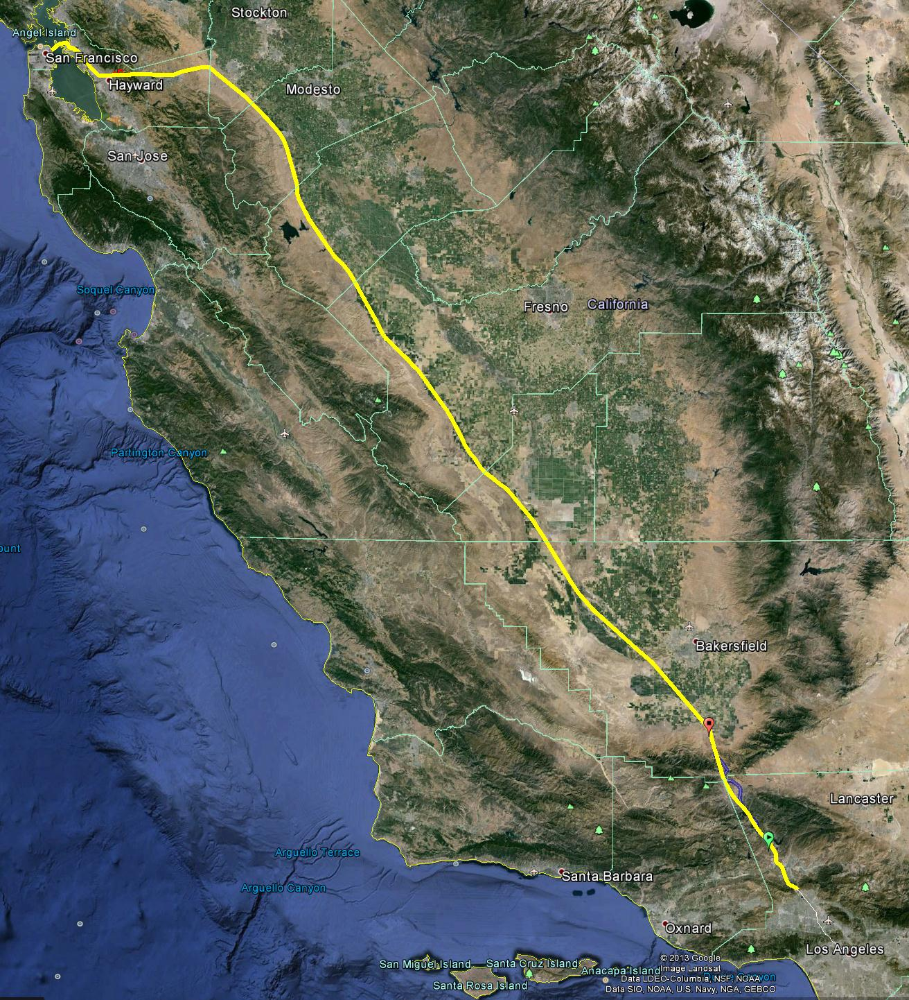
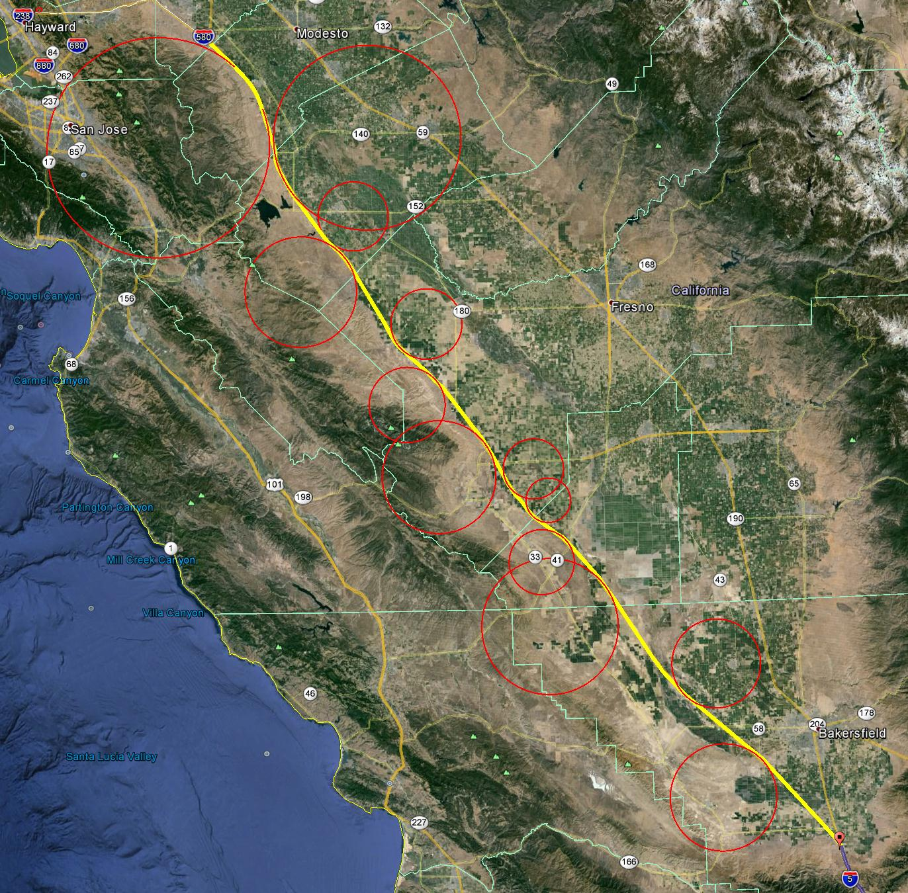
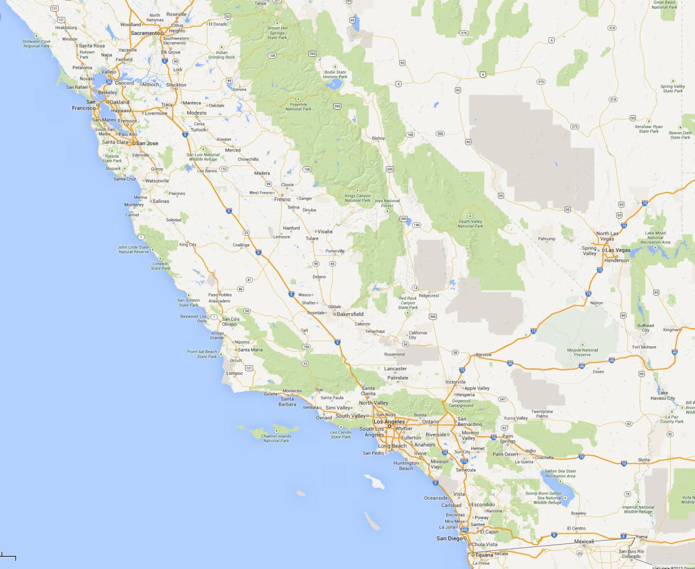

**4.4. Route**

The  Hyperloop  will  be  capable  of  traveling  between  Los  Angeles  and  San
Francisco  in  approximately  35  minutes.  This  requirement  tends  to  size  other
portions of the system. Given the performance specification of the Hyperloop,
a  route  has  been  devised  to  satisfy  this  design  requirement.  The  Hyperloop
route should be based on several considerations, including:

1.  Maintaining the tube as closely as possible to existing rights of way (e.g.,
 following the I-5).

2.  Limiting  the  maximum  capsule  speed  to  760  mph  (1,220  kph)  for
 aerodynamic considerations.
 3.  Limiting accelerations on the passengers to 0.5g.
4.  Optimizing  locations  of  the  linear  motor  tube  sections  driving  the
 capsules.

5.  Local  geographical  constraints,  including  location  of  urban  areas,

mountain  ranges,  reservoirs,  national  parks,  roads,  railroads,  airports,
etc. The route must respect existing structures.

For  aerodynamic  efficiency,  the  velocity  of  a  capsule  in  the  Hyperloop  is
typically:

* * * * *

* 300 mph (480 kph) where local geography necessitates a tube bend radii
 \< 1.0 mile (1.6 km)

* 760  mph  (1,220  kph)  where  local  geography  allows  a  tube*  *bend  \>  3.0
 miles (4.8 km) or where local geography permits a straight tube.

These  bend  radii  have  been  calculated  so  that  the  passenger  does  not
experience  inertial  accelerations  that  exceed  0.5g.  This  is  deemed  the
maximum  inertial  acceleration  that  can  be  comfortably  sustained  by  humans
for  short  periods.  To  further  reduce  the  inertial  acceleration  experienced  by
passengers,  the  capsule  and/or  tube  will  incorporate  a  mechanism  that  will
allow a degree of ‘banking’.
 The Hyperloop route was created by the authors using Google Earth.

* * * * *

**Figure 25. Overview of Hyperloop route
from Los Angeles to San Francisco.**

**4.4.1. Route Optimization**

In  order  to  avoid  bend  radii  that  would  lead  to  uncomfortable  passenger
inertial accelerations and hence limit  velocity, it is necessary to optimize the
route.  This  can  be  achieved  by  deviating  from  the  current  highway  system,
earth removal, constructing
pylons to achieve elevation change or tunneling.
 The proposed route considers a combination of 20, 50, and 100 ft (6,
15, and 30
m,  respectively)  pylon  heights  to  raise  and  lower  the  Hyperloop  tube  over
geographical obstacles. A total tunnel length of 15.2 miles (24.5 km) has been

* * * * *

included  in  this  optimization  where  extreme  local  gradients  (\>6%)  would
preclude  the  use  of  pylons.  Tunneling  cost  estimations  are  estimated  at  \$50
million  per  mile  (\$31  million  per  km).  The  small  diameter  of  the  Hyperloop
tube should keep tunneling costs to a far
more reasonable level than traditional
automotive and rail tunnels.
 The route has been divided into the following sections:
* Los Angeles/Grapevine – South and North
* I-5
* I-580/San Francisco Bay
 *Summary*

•  300 mph (480 kph) for the Los Angeles Grapevine South section at 0.5g.
 Total time of 167 seconds

•  555 mph (890 kph) for the Los Angeles Grapevine North section at 0.5g.
 Total travel time of 435 seconds
 •  760 mph (1,220 kph ) along I-5 at 0.5g.
 Total travel time of 1,518 seconds

•  555  mph  (890  kph)  along  I-580  slowing  to  300  mph  (480  kph)  into  San
 Francisco.

 Total travel time of 2,134 seconds (35 minutes)

The  velocity  [(Figure  26)  ](hyperloop_alpha.html#42)along  the  Hyperloop  and  distance  [(Figure  27)  ](hyperloop_alpha.html#43)as  a
function of time summarize the route.

* * * * *

**Figure 26. Velocity of capsule as a function of time
from Los Angeles departure.**

* * * * *

**Figure 27. Distance of capsule as a function of time
from Los Angeles departure.**

**4.4.1.1. Los Angeles/Grapevine - South**
 *Visualization* -
 The  preliminary  route  is  shown  in  yellow.  Bend  radii  are
shown  in  red.  The  green  dashed  line  delineates  the
north/south Grapevine definition in this document.
 *Route* -
 Follows I-5 through Santa Clarita and Castaic.

* * * * *

**Figure 28. Los Angeles/Grapevine South Section of
proposed Hyperloop route.**

**Table 3. Los Angeles/Grapevine South data at 300 mph (480 kph).**

**Criteria**

**0.5g**

**  Acceleration**
 Min. bend radius at
 300 mph (483 kph)
 2.28 miles
 (3.67 km)
 Section Distance
 13.4 miles
 (21.6 km)
 Journey time
 167.6 seconds
 Tunnel distance
 1.0 miles
 (1.61 km)

* * * * *

No. of 20 ft (6 m)
 563
 pylons
No. of 50 ft (15 m)
 pylons
 80
 No. of 100 ft (30 m)
 12
 Pylons
Additional length
 Required
 1.20 miles
 (1.93 km)

**4.4.1.2. Los Angeles/Grapevine – North**
 *Visualization* -
 The  preliminary  route  is  shown  in  yellow.  Bend  radii  are
shown  in  red.  The  green  dashed  line  delineates  the
north/south Grapevine definition in this document.
 *Route* -
 Significant  deviation  from  I-5  in  order  to  increase  bend
radius and develop straight sections.

* * * * *

**Figure 29. Los Angeles/Grapevine North Section of
proposed Hyperloop route.**

**Table 4. Los Angeles/Grapevine North data at 555 mph (890 kph).**

**Criteria**

**0.5g**

**Acceleration**
 Min. bend radius at
 555 mph (890 kph)
 7.80 miles
 (12.6 km)
 Distance
 40.0 miles
 (64.4 km)
 Journey time
 267.4 seconds
 Tunnel distance
 10.7 miles
 (17.2 km)

* * * * *

 No. of 20 ft (6 m)
 Pylons
 492
 No. of 50 ft (15 m)
 Pylons
 260
 No. of 100 ft (30 m)
 Pylons
 795
 Additional length
 required
 24 miles
 (38.6 km)

**4.4.1.2. I-5**
 *Visualization* -
 The  preliminary  route  is  shown  in  yellow.  Bend  radii  are
shown in red.
 *Route* -
 Follows I-5 to minimize land/right of way purchase costs.

**Figure 30. I-5 Section of proposed Hyperloop route.**

* * * * *

**Table 5. I-5 Section data at 760 mph (1,120 kph).**

**Criteria**

**0.5g**

**Acceleration**
 Min. bend radius at 760
mph (1,220 kph)
 14.6 miles
 (23.5 km)
 Distance
 227 miles
 (365 km)
 Journey time
 1,173.0 seconds
 Tunnel distance
 0 miles
 (0 km)
 No. of 20 ft (6 m)
 pylons
 10,930
 No. of 50 ft (15 m)
 pylons
 1,056
 No. of 100 ft (30 m)
pylons
 0
 Additional length
 required
 14 miles
 (22.5 km)

**4.4.1.3. I-580/San Francisco Bay**
 *Visualization* -
 The  preliminary  route  is  shown  in  yellow.  Bend  radii  are
shown in red.
 *Route* -
 Follows I-580 to minimize land/right of way purchase costs.
Deviation  from  I-580  West  of  Dublin  in  order  to  develop
straight sections.

* * * * *

****

**Figure 31. I-580/San Francisco Bay Section of
proposed Hyperloop route.**

**Table 6. I-580/San Francisco Bay Section data at
300, 555, and 760 mph (480, 890, and 1,120**

**kph, respectively).**

**Criteria**

**0.5g**

**Acceleration**
 Min. bend radius at
 300 mph (480 kph)
 2.28 miles
 (3.67 km)
 Min. bend radius at
 555 mph (890 kph)
 7.80 miles
 (12.55 km)
 Min. bend radius at
 760 mph (1,220 kph)
 14.6 miles
 (23.5 km)
 Distance
 73.9 miles
 (119 km)
 Journey time
 626.0 seconds
 Tunnel distance
 3.5 miles
 (5.6 km)
 No. of 20 ft (6 m)
 pylons
 2,783
 No. of 50 ft (15 m)
 pylons
 775
 No. of 100 ft (30 m)
 pylons
 159
 Additional length
 required
 5.7 miles
 (9.2 km)

* * * * *

**4.4.3. Station Locations**

The  major  stations  for  Hyperloop  are  suggested  based  on  high  traffic  regions
between  major  cities.  The  largest  cities  by  metro  population  in  California
according  to  2010  to  2012  estimates  from  various  sources  [(Table  7)](hyperloop_alpha.html#50)  are
considered for station locations.

**Table 7. Largest cities in California by 2013 population.**

**City**

**Population**

****

**(millions)**
 Los Angeles
 18.1
 San
 Francisco/San
 8.4
 Jose
 San Diego
 3.1
 Sacramento
 2.6
 Fresno
 1.1

* * * * *

Stations at these major population centers are considered for Hyperloop.  One
additional  traffic  corridor  to  consider  is  between  Los  Angeles,  California  and
Las Vegas, Nevada with a metro population of 2.1 million. Significant traffic is
present through this corridor on a weekly basis.

**Suggested main route
Suggested main stations
Proposed branches
Proposed branch stations**

**Figure 32. Suggested Hyperloop route map (map courtesy of
Google Maps).**

The  traffic  between  Los  Angeles,  California  and  San  Francisco/San  Jose,
California is estimated to be at least 6 million travelers per year. This possibly
represents the busiest corridor of travel in California. Travel along this corridor
is  anticipated  to  increase  with  completion  of  the  Hyperloop  due  to  both
decreased travel time and decreased travel cost.

Additional Hyperloop stations are suggested considered at the following major
population centers:
 1.  San Diego, California:
 a.  Connects to Los Angeles, California main station.
b.  Capsule departures every 5 minutes.
c.  Transports around 3 million people per year.
 2.  Las Vegas, Nevada:

* * * * *

a.  Connects to Los Angeles, California main station.
b.  Uses a portion of the San Diego branch route near Los Angeles and
 tube branches near San Bernardino, California.
 c.  Capsule departures every 8 minutes.
d.  Transports around 1.8 million people per year.
 3.  Sacramento, California:
 a.  Connects to San Francisco, California main station.
b.  Uses  a  portion  of  the  main  route  near  San  Francisco  and  tube
 branches near Stockton, California.
 c.  Capsule departures every 15 minutes.
d.  Transports around 1 million people per year.
 4.  Fresno, California:

a.  Connects  to  both  San  Francisco,  California  and  Los  Angeles,
 California main stations.
 b.  Los Angeles bound travelers:

i.  Uses  the  main  route  closer  to  San  Francisco  plus  a  small
 branch along State Route 41 near Fresno.
 ii.  Capsule departures every 15 minutes.
 iii.  Transports around 1 million people per year.
 c.  San Francisco bound travelers:
 i.  Uses  the  main  route  closer  to  Los  Angeles  plus  a  small
 branch along State Route 41 near Fresno.
 ii.  Capsule departures every 30 minutes.
 iii.  Transports around 0.5 million people per year.

