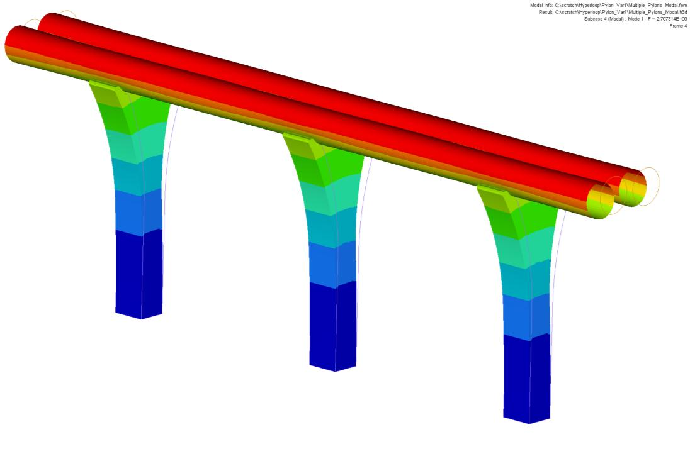
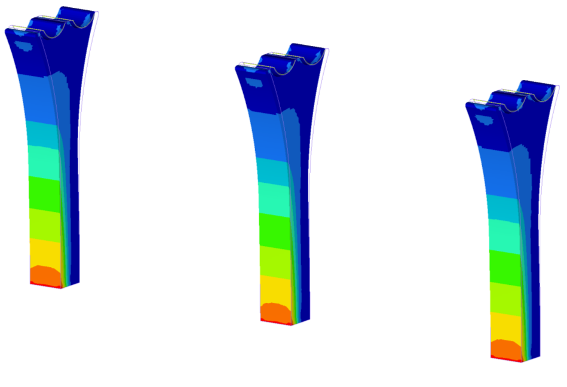
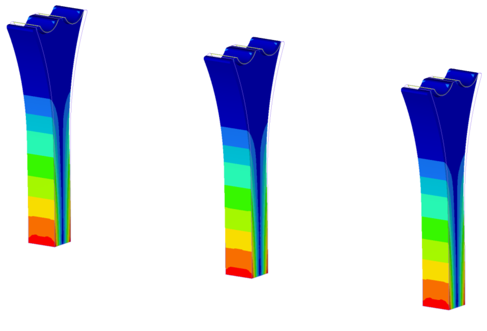

**4.2. Tube**

The  main  Hyperloop  route  consists  of  a  partially  evacuated  cylindrical  tube
that  connects  the  Los  Angeles  and  San  Francisco  stations  in  a  closed  loop
system [(Figure 2).](hyperloop_alpha.html#10) The tube is specifically sized for optimal air flow around the
capsule improving performance and energy consumption at the expected travel
speed. The expected pressure inside the tube will be maintained around 0.015
psi  (100  Pa,  0.75  torr),  which  is  about  1/6  the  pressure  on  Mars.  This  low
pressure minimizes the drag force on the capsule while maintaining
the relative
ease of pumping out the air from the tube. The efficiency of industrial vacuum
pumps  decreases  exponentially  as  the  pressure  is  reduced  [(Figure  13),](hyperloop_alpha.html#24)  so
further  benefits  from  reducing  tube  pressure  would  be  offset  by  increased
pumping complexity.

**Figure 13. Typical vacuum pump
speed for functional pressure range.**

In order to minimize cost of the Hyperloop tube, it will be elevated on pillars
which greatly reduce the footprint required on the ground and the size of the
construction  area  required.  Thanks  to  the  small  pillar  footprint  and  by
maintaining the route as close as possible to currently operated highways, the
amount  of  land  required  for  the  Hyperloop  is  minimized.  More  details  are
available for the route in section 4.4.

The  Hyperloop  travel  journey  will  feel  very  smooth  since  the  capsule  will  be
guided directly on the inner surface of the tube via the use of air bearings and
suspension; this also prevents the need for costly tracks. The capsule will bank
off  the  walls  and  include  a  control  system  for  smooth  returns  to  nominal
capsule location from banking as well.  Some specific sections of the tube will
incorporate the stationary motor element (stator) which will  locally guide and
accelerate  (or  decelerate)  the  capsule.  More  details  are  available  for  the
propulsion  system  in  section  4.3.  Between  linear  motor  stations,  the  capsule
will glide with little drag via air bearings.

* * * * *

**4.2.1. Geometry**

The  geometry  of  the  tube  depends  on  the  choice  of  either  the  passenger
version of Hyperloop or the passenger plus vehicles version of
Hyperloop.

In either case, if the speed of the air passing through the gaps accelerates  to
supersonic velocities, then shock waves form.  These waves limit how much air
can actually get out of the way of the capsule, building up a column of air in
front  of  its  nose  and  increasing  drag  until  the  air  pressure  builds  up
significantly  in  front  of  the  capsule.  With  the  increased  drag  and  additional
mass  of  air  to  push,  the  power  requirements  for  the  capsule  increase
significantly.  It  is  therefore  very  important  to  avoid  shock  wave  formation
around  the  capsule  by  careful  selecting  of  the  capsule/tube  area  ratio.  This
ensures sufficient mass air flow around and through the capsule at all operating
speeds. Any air that cannot pass around the annulus between the capsule and
tube is bypassed using the onboard compressor in each capsule.

**Figure 14. Hyperloop capsule in tube cutaway with attached solar arrays.**
 *Passenger Hyperloop Tube *

The inner diameter of the tube is optimized to be 7 ft 4 in. (2.23 m) which is
small  enough  to  keep  material  cost  low  while  large  enough  to  provide  some
alleviation of
choked air flow around the capsule. The tube cross-sectional area
is 42.2 ft2 (3.91 m2) giving a capsule/tube area ratio of 36% or a diameter ratio
of  60%.  It  is  critical  to  the  aerodynamics  of  the  capsule  to  keep  this  ratio  as
large  as  possible, even  though the  pressure  in the tube is  extremely  low.    As
the capsule moves through the tube, it must displace its own volume of air, in

* * * * *

a  loosely  similar  way  to  a  boat  in  water.  The  displacement  of  the  air  is
constricted  by  the  walls  of  the  tube,  which  makes  it  accelerate  to  squeeze
through  the  gaps.  Any  flow  not  displaced  must  be  ingested  by  the  onboard
compressor of each capsule, which increases power requirements.

The closed loop tube will be mounted side by side on elevated pillars as seen in
Figure 5. The surface above the tubes will be lined with solar panels to provide
the required system energy. This represents a possible area of 14 ft (4.25 m)
wide for more than 350 miles (563 km) of tube length. With an expected solar
panel energy production of 0.015 hp/ft2 (120 W/m2), we can expect the system
to  produce  a  maximum  of  382,000  hp  (285**  **MW)  at  peak  solar  activity.  This
would actually be more energy than needed for the Hyperloop system and the
detailed power requirements will be detailed in section 4.3.
 *Passenger Plus Vehicle Hyperloop Tube *

The inner diameter of the tube is optimized to be 10 ft 10 in. (3.30 m), larger
than the passenger version to accommodate the larger capsule. The tube cross-
sectional area is 92.1 ft2 (8.55 m2) giving a capsule/tube area ratio of 47% or a
diameter ratio of 68%.

The closed passenger plus vehicle Hyperloop tube will be mounted side by side
in the same manner as the passenger version as seen in Figure 5. The surface
above the tubes will be lined with solar panels to provide the required system
energy. This represents a possible area of 22 ft (6.6 m) wide for more than 350
miles (563 km) of tube length. With an expected solar panel energy production
of 0.015 hp/ft2 (120W/m2), we can expect the system to produce a maximum
of  598,000  hp  (446**  **MW)  at  peak  solar  activity.  This  would  actually  be  more
energy  than  needed  for  the  passenger  plus  vehicle  Hyperloop  system  and  the
detailed power requirements will be detailed in section 4.3.
 *Station Connections *

The  stations  are  isolated  from  the  main  tube  as  much  as  possible  in  order  to
limit air leaks into the system. In addition, isolated branches  and stations off
the main tubes could be built to access some towns along the way between Los
Angeles  and  San  Francisco.  Vacuum  pumps  will  run  continuously  at  various
locations  along  the  length  of  the  tube  to  maintain  the  required  pressure
despite any possible leaks through the joint and stations. The expected cost of
all required vacuum pumps is expected to be no more than \$10 million USD.

**4.2.2. Tube Construction
**In order to keep cost to a minimum, a uniform thickness steel tube reinforced
with  stringers  was  selected  as  the  material  of  choice  for  the  inner  diameter
tube  Tube  sections  would  be  pre-fabricated  and  installed  between  pillar
supports  spaced  100  ft  (30  m)  on  average,  varying  slightly  depending  on

* * * * *

location.  This  relatively  short  span  allows  keeping  tube  material  cost  and
deflection to a minimum.

The  steel  construction  allows  simple  welding  processes  to  join  different  tube
sections  together.  A  specifically  designed  cleaning  and  boring  machine  will
make it possible to surface finish the inside of the tube and welded joints for a
better  gliding  surface.  In  addition,  safety  emergency  exits  and  pressurization
ports will be added in key locations along the length of the tube.
 *Passenger Hyperloop Tube *

A  tube  wall  thickness  between  0.8  and  0.9  in.  (20  to  23  mm)  is  necessary  to
provide  sufficient  strength  for  the  load  cases  considered  such  as  pressure
differential, bending and buckling between pillars, loading due to the capsule
weight and acceleration, as well as seismic considerations.

The expected cost for the tube is expected to be less than \$650 million USD,
including  pre-fabricated  tube  sections  with  stringer  reinforcements  and
emergency  exits.  The  support  pillars  and  joints  which  will  be  detailed  in
section 4.2.3.
 *Passenger Plus Vehicle Hyperloop Tube *

The  tube  wall  thickness  for  the  larger  tube  would  be  between  0.9  and  1.0  in
(23 to 25 mm). Tube cost calculations were also made for the larger diameter
tube which would allow usage of the cargo and vehicle capsule in addition to
the passenger capsule. In that case, the expected cost for the tube is expected
to  be  less  than  \$1.2  billion  USD.  Since  the  spacing  between  pillars  would  not
change  and  the  pillars  are  more  expensive  than  the  tube,  the  overall  cost
increase is kept to a minimum.

**4.2.3. Pylons and Tunnels**

The tube will be supported by pillars which constrain the tube in the vertical
direction but allow longitudinal slip for thermal expansion as well as dampened
lateral slip to reduce the risk posed by earthquakes.  In addition, the pillar to
tube connection nominal position will be adjustable vertically and laterally to
ensure  proper  alignment  despite  possible  ground  settling.  These  minimally
constrained  pillars  to  tube  joints  will  also  allow  a  smoother  ride.  Specially
designed slip joints at each stations will be able take any tube length variance
due to thermal expansion. This is an ideal location for the thermal expansion
joints as the speed is much lower nearby the stations.
It thus allows the tube to
be smooth and welded along the high speed gliding middle section.
 The spacing of
the Hyperloop pillars retaining the tube is critical to achieve the
design  objective  of  the  tube  structure.  The  average  spacing  is  100  ft  (30  m),
which means there will be near 25,000 pillars supporting both tubes and solar

* * * * *

panels.  The pillars will be 20 ft (6 m) tall  whenever possible but may vary in
height in hilly areas or where obstacles are in the way. Also, in some key areas,
the  spacing  will  have  to  vary  in  order  to  pass  over  roads  or  other  obstacles.
Small spacing between each support reduces the deflection of the tube keeping
the  capsule  steadier  and  the  journey  more  enjoyable.  In  addition,  reduced
spacing  has  increased  resistance  to  seismic  loading  as  well  as  the  lateral
acceleration of the capsule.

Due to the sheer quantity of pillars required, reinforced concrete was selected
as the construction material due to its very low cost per volume. In some short
areas,  tunneling  may  be  required  to  avoid  going  over  mountains  and  to  keep
the route as straight as possible. The expected cost for the pillar construction
and  tube  joints  is  expected  to  be  no  more  than  \$2.55  billion  USD  for  the
passenger  version  tube  and  \$3.15  billion  USD  for  the  passenger  plus  vehicle
version  tube.  The  expected  cost  for  the  tunneling  is  expected  to  be  no  more
than \$600 million USD for the smaller diameter tube and near \$700 million USD
for the larger diameter tube.

Structural  simulations  [(Figure  15  ](hyperloop_alpha.html#28)through  [Figure  20)  ](hyperloop_alpha.html#31)have  demonstrated  the
capability  of  the  Hyperloop  to  withstand  atmospheric  pressure,  tube  weight,
earthquakes, winds, etc. Dampers will be incorporate between the pylons and
tubes to isolate movements in the ground from the tube.

**Figure 15. First mode shape of
Hyperloop at 2.71Hz (magnified x1500).**

* * * * *

 

**Figure 16. Second mode shape of Hyperloop at
3.42Hz (magnified x1500).**

**Figure 17. Deformation at 1g Inertia in X (in.) (magnified x10).**

* * * * *

 

**Figure 18. Maximum
principal stress at 1g Inertia in X (psi) (magnified x10).**

**Figure 19.  Minimum principal stress at 1g Inertia in X (psi) (magnified x10).**

* * * * *

**Figure 20. Maximum
shear stress at 1g Inertia in X (psi) (magnified x10).**

**4.2.4. Station Construction**

The intention for Hyperloop stations is for them to be minimalist but practical
and with a boarding process and layout much simpler than airports.

Due to the short travel time and frequent departures, it is envisaged that there
will  be  a  continual  flow  of  passengers  through  each  Hyperloop  station,  in
contrast  to  the  pulsed  situation  at  airports  which  leads  to  lines  and  delays.
Safety and security are paramount, and so security checks will still be made in
a  similar  fashion  as  TSA  does  for  the  airport.  The  process  could  be  greatly
streamlined  to  reduce  wait  time  and  maintain  a  more  continuous  passenger
flow.

All  ticketing  and  baggage  tracking  for  the  Hyperloop  will  be  handled
electronically,  negating  the  need  for  printing  boarding  passes  and  luggage
labels.  Since Hyperloop travel time is very short, the main usage is more for
commuting  than  for  vacations.  There  would  be  a  luggage  limit  of  2  bags  per
person, for no more than 110 lb (50 kg) in total.  Luggage would be stowed in a
separate compartment at the rear of the capsule, in a way comparable to the
overhead  bins  on  passenger  aircraft.    This  luggage  compartment  can  be
removed  from  the  capsule,  so  that  the  process  of  stowing  and  retrieving
luggage  can  be  undertaken  separately  from  embarking  or  disembarking  the
capsule’s passenger
cabin. In addition, Hyperloop staff will take care of loading
and unloading passenger luggage in order to maximize efficiency.

The transit area at a Hyperloop terminal would be a large open area with two
large airlocks signifying the entry and exit points for the capsules.  An arriving
capsule would enter the incoming airlock, where the pressure is equalized with

* * * * *

the  station,  before  being  released  into  the  transit  area.    The  doors  of  the
capsule  would  open,  and  the  passengers  could  disembark.    The  luggage  pod
would  be  quickly  unloaded  by  the  Hyperloop  staff  or  separated  from  the
capsule  so  that  baggage  retrieval  would  not  interfere  with  the  capsule
turnaround.

Once vacated, the capsule would be rotated on a turntable, and aligned for re-
entry into the Hyperloop tube.  The departing passengers, and their pre-loaded
luggage pod, would then enter the capsule.  A Hyperloop attendant will then
perform  a  safety  check  of  each  passenger’s  seat  belts  before  the  capsule  is
cleared for departure.  At this point the capsule would then be moved forward
into  the exit  airlock, where  the  pressure is  lowered  to  the  operating  level  of
the  Hyperloop,  and  then  sent  on  its  way.  Note  that  loading  and  unloading
occurring in parallel with up to three capsules at a given station at any time.
The expected cost for each station is expected to be around \$125 million for a
total of \$250 million** **USD initially.

**4.2.5. Cost
**The  overall  cost  of  the  tube,  pillars,  vacuum  pumps  and  stations  is  thus
expected  to  be  around  \$4.06  billion  USD  for  the  passenger  version  of
Hyperloop.  This  does  not  include  the  cost  of  the  propulsion  linear  motors  or
solar panels. The tube represents approximately 70% of
the total budget.

The  larger  10  ft  10  in.  (3.3  m)  tube  that  would  allow  the  cargo  and  vehicle
capsules  to  fit,  would  have  a  total  cost  including  the  tube,  pillars,  vacuum
pumps, and stations around \$5.31 billion USD. This minimal cost increase would
allow a much more versatile Hyperloop system.
